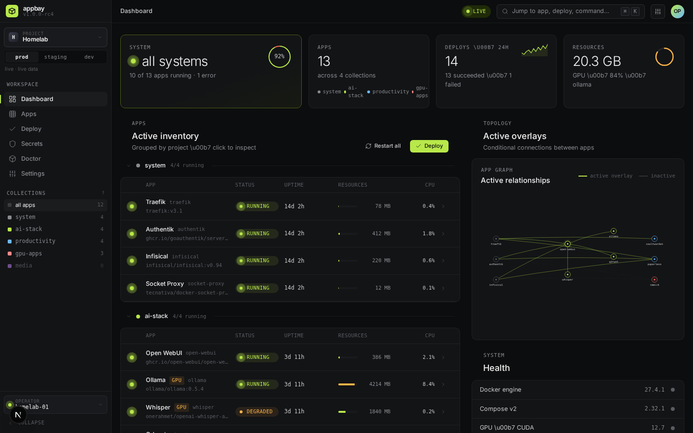
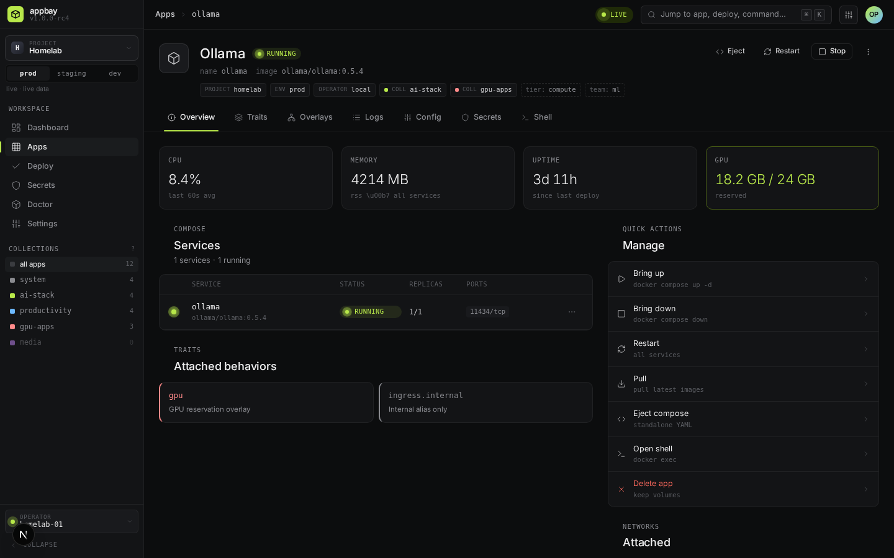

# appbay

Docker-native PaaS control plane built around Docker Compose. Treats Compose as the application model and augments it with traits, scoped variables, conditional overlays, and namespace isolation.





## Quick Start

```bash
# Install (Linux/macOS, Docker or Podman required)
curl -fsSL https://raw.githubusercontent.com/kundeng/appbay-cli/main/scripts/install.sh | sh

# Check prerequisites
appbay doctor

# Initialize
appbay init

# Start the web UI
appbay server start
# Open http://localhost:3000

# Browse available apps
appbay catalog list

# Install and deploy an app
appbay install uptime-kuma
appbay up uptime-kuma

# Or deploy a system app directly
appbay up whoami
appbay ps whoami
```

<details>
<summary>Build from source</summary>

```bash
# Prerequisites: Node.js 22+, pnpm, Bun
git clone https://github.com/kundeng/appbay-cli.git
cd appbay-cli
pnpm install
pnpm turbo build
./apps/cli/dist/appbay doctor
```

Bun is required — the CLI compiles to a single binary with `bun build --compile`, and the
sources use `.js` specifiers for `.ts` files, so Node cannot run them directly.
</details>

## What It Does

Appbay takes your Docker Compose apps and adds:

- **Namespace isolation** — run multiple apps with identical service names without conflicts
- **Traits** — declarative capabilities (ingress, GPU, auth, hooks, backup) attached to apps
- **Conditional overlays** — automatic cross-app wiring (e.g., "when ollama is *installed*, inject its URL into webui")
- **Scoped variables** — ${{scope.KEY}} references resolved at compile time (see the caveat under Scope Model)
- **Secret URI references** — `vault://`, `keepass://`, `file://`, `env://`, `sops://` resolved at deploy time
- **Config overrides** — `.env.local` for catalog-installed apps, upstream `.env` stays frozen
- **Plan/diff** — see exactly what will change before deploying, with secrets redacted

Your upstream Compose files are never modified. `appbay.yaml` is a policy layer beside them,
and `appbay eject` gives you a standalone Compose file that runs without Appbay at all.

## Architecture

```
CLI (bun binary)  ←→  packages/core (compiler)  ←→  Docker / Podman Compose
                           ↑
Web control plane  ←→  tRPC API  ←→  SQLite (metadata cache)
   (container)                            ↑
                               Filesystem (source of truth)
```

- **Filesystem is the source of truth** — `appbay.yaml` + `docker-compose.yml` on disk
- **SQLite is a cache** — delete `appbay.db`, run `appbay rebuild-cache`, everything recovers
- **The CLI is complete on its own** — compile, validate, deploy, eject all work with no server running
- **The web control plane is optional** — `appbay server start` pulls and runs it as a container
  (`ghcr.io/kundeng/appbay-server`). It is a separate component and is not part of this
  repository; the CLI consumes it as a published image and never needs its source.

## Container runtimes

Docker and rootful Podman are both supported, selected at init:

```bash
appbay init --container-runtime docker    # default
appbay init --container-runtime podman
```

Runtime choice is configuration, not a code path — there is no `if (runtime === "podman")`
in the codebase. Rootless Podman has documented limitations (it cannot bind :80/:443, so it
has no edge); see the quickstart guide.

## CLI Commands

```
appbay init              Scaffold ~/.appbay, seed system apps
appbay init-system       Host bootstrap: service account, ACLs, systemd (sudo)
appbay setup             Guided first run: vault, edge, TLS, first deploy
appbay doctor            Check prerequisites (runtime, Compose, GPU)
appbay validate [apps]   Validate appbay.yaml + compose schemas
appbay compile [apps]    Render final compose from traits/overlays
appbay apply [apps]      Compile, review plan, deploy
appbay up [apps]         Compile + deploy
appbay down [apps]       Stop apps
appbay restart [apps]    Down + up
appbay list              List discovered apps
appbay status [app]      Show app details, traits, overlays
appbay ps [apps]         Container status
appbay logs [app]        Stream logs
appbay eject <app>       Export standalone compose (no Appbay needed)
appbay catalog list      Browse the app catalog
appbay catalog search    Search catalog by name/tag/category
appbay install <app>     Install an app from the catalog
appbay pull [apps]       Pull latest images
appbay delete <app>      Remove app definition (--keep-volumes, --force)
appbay secrets check     Verify all secret URIs resolve
appbay config <app>      Get/set appbay.yaml values
appbay env <app>         Manage app environment variables
appbay presets           Manage app selection presets
appbay open <app>        Open app URL in browser
appbay url <app>         Print app URL
appbay size [app]        Show disk usage for apps
appbay fixfs <app>       Fix filesystem permissions for volumes
appbay server start      Start the web control plane
appbay update            Self-update CLI binary
appbay rebuild-cache     Regenerate SQLite from files
appbay home              Print APPBAY_HOME path
appbay info              System info (OS, runtime, GPU, apps)
appbay completion        Generate shell completions
```

`appbay --help` is authoritative, and
[the CLI reference](docs/reference/cli-commands.qmd) documents every flag.

### The three credentials

AppBay has three independent passwords. Each is recovered by a different command, and
they are never synchronized — see [the credentials guide](docs/guide/credentials.qmd).

```
appbay secrets vault rotate-password     The vault password (unlocks vault.enc)
appbay edge users reset-password <user>  An edge user (signs in to your deployed apps)
appbay admin reset-password <user>       The AppBay control-plane account (the web UI)
```

⚠️ `appbay admin reset-password` needs the control-plane database, which only the server
creates. On a CLI-only install it crashes with a raw `SQLiteError` and leaves a zero-byte
`var/lib/appbay.db` behind — verified 2026-08-31 against `v0.0.1-alpha.11`. If you have not
deployed the web UI, the account it resets does not exist and this command has nothing to do.
The credential you almost certainly want is `appbay edge users reset-password`.

`appbay authelia` and `appbay auth` are retired; running either explains what replaced it
and exits non-zero.

## Scope Model

| Concept | Controls | Cardinality |
|---------|----------|-------------|
| **Namespace** | Deployment identity — container, network and DNS-alias names | Single per app |
| **Collection** | Which apps deploy together | Multi per app |

`namespace` replaced `project` + `environment` in `v0.0.1-alpha.12`; a non-default value for
either is now a parse error naming the migration. Collections are selectors, not scope levels.

⚠️ Of the `${{scope.KEY}}` vocabulary, only `${{project.DOMAIN}}` resolves today — it reads
the `domain:` line from `$APPBAY_HOME/project.yaml`. `${{environment.KEY}}` and
`${{service.KEY}}` parse but resolve against empty maps. See
[the scope model reference](docs/reference/scope-model.qmd).

## Project Structure

```
packages/
  core/     Compiler pipeline, Zod schemas, trait registry, secret resolution
  db/       Drizzle ORM + SQLite schema, cache store
apps/
  cli/      CLI binary (bun build --compile)
system-apps/      Bundled app definitions. One host runs ONE edge:
  traefik/        Edge: ingress only
  caddy/          Edge: ingress + identity (Caddy Security). Required for auth traits
  ollama/         Local LLM inference
  open-webui/     Chat UI for Ollama
  vaultwarden/    Bitwarden-compatible password manager
  homeassistant/  Home automation
  nextcloud/      File sync and collaboration
  jellyfin/       Media server
  homepage/       Dashboard
  keeweb/         KeePass web UI for secrets
  sysinfo/        Operator diagnostics
  whoami/         Protocol fixture / starter demo
docs/             Quarto documentation website
```

`system-apps/` is the source; `packages/core/src/system-apps.ts` is generated from it by
`scripts/generate-system-apps.mjs`. **Edit the directory, then run the generator** — a test
fails if the committed output drifts.

## Development

```bash
pnpm install
pnpm turbo build          # Build all packages
pnpm turbo test           # Run all tests
pnpm check:system-apps    # Verify generated system apps match the source
pnpm check:straddle       # Verify the open-core boundary holds
```

## Docs

The documentation site is built with Quarto from `docs/`:

- [Quickstart](docs/guide/quickstart.qmd) — install through first deploy
- [Concepts](docs/guide/concepts.qmd) — apps, traits, overlays, scopes
- [Traits](docs/guide/traits.qmd) and [Overlays](docs/guide/overlays.qmd)
- [Secrets](docs/guide/secrets.qmd) and [Credentials](docs/guide/credentials.qmd)
- [Catalog](docs/guide/catalog.qmd) — installing curated apps
- [Reference](docs/reference/index.qmd) — `appbay.yaml` schema, CLI, API, scope model

## Contributing

Contributions are welcome — see [CONTRIBUTING.md](CONTRIBUTING.md) for the development
setup and the sign-off requirement.

## License

MIT — see [LICENSE](LICENSE).
