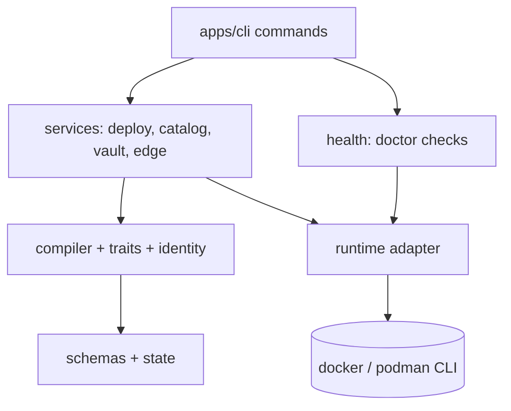

# System design — 2026-09-05

The architect's model of the code as it is, with the places the model is violated.

## Component map

Intended: only `RT` reaches `ENG`. Measured: `CLI` reaches `ENG` directly at 12 sites
(literal `docker`) and through 3 private `tryExec` copies; `SVC` parses `ENG` output in
`deploy-service.ts:100-270`; `CMP` spawns `ENG` at `compile.ts:650-665` (ollama).

## Relationships

| from | to | what crosses | verified |
|---|---|---|---|
| `cli/commands/up.ts` | `services/deploy-service.ts` `deploy()` | `DeployOptions` with an injected compose runner; `DeployResult` counts back | `up.ts:52` |
| `deploy()` | `compiler/compile.ts` `compile()` | apps dir, renders dir, project vars, runtime facts; no namespace | `deploy-service.ts:616` |
| `compile()` | `compiler/identity.ts` | namespace, app, service → six names | `upstream-transform.ts:107-185` |
| `compile()` | `traits/definitions/ingress.ts` | trait props → edge fragment under the provider app dir | `ingress.ts:151,165` |
| `deploy()` | `runtime` via the runner | `compose -f <render> up -d`, `compose ps` | `deploy-service.ts:819,105` |
| `deploy()` | the edge container, by literal name | `exec … caddy validate/reload` | `deploy-service.ts:416` — the name is retired |
| `health/checks.ts` | `runtime` and `schemas/instance.ts` | 17 checks, `passed`/`required` | `checks.ts:1018` |
| `schemas/instance.ts` | `etc/system.yaml` | the one loader; 7 of 8 callers `?? ""` | `instance.ts:298` |

## Journeys traced

| journey | components in order | break |
|---|---|---|
| install host | `init.ts` → `schemas/instance.ts` (write) → system apps copied → `network create` | none seen; `network create` result discarded `[src: init.ts:327]` |
| install app | `install.ts` → `catalog-service.ts` (copy) → `validate` | validation result ignored; "ready to deploy" unconditional |
| deploy app (caddy) | `up.ts` → `deploy()` → `compile()` → `up -d` → `findCrashedServices` → `installCaddyConfig` → tally | `installCaddyConfig` inspects `appbay.caddy.caddy`; the edge is `appbay.system.caddy.caddy` → `unavailable` → app counted failed |
| deploy app (traefik) | same to `installCaddyConfig` | no caddy files → returns ok without touching the edge; `deployed` with no edge observed |
| doctor | `doctor.ts` → `runChecks` → `buildDoctorJson` | `ok` true over checks that could not run |
| second instance | `install --as` → two dirs → two compiles | both render `host: <name>.<domain>`; identity separates, values do not |

## Decisions in force, and the review question for each

**Namespace enters identity, not values** (RFC-001 §4; `identity.ts`).
Context: `project`/`environment` carried nothing and shadowed the invocation. Choice: one
optional `namespace`, folded into generated names, omitted when `default`. Why: two
instances in one home without renaming every existing host. Alternatives: a per-namespace
value store (4.6, rejected as "a label with no store"). Consequence: the hostname, the one
field F49 measured as colliding, still collides. Review question: does the stem
(`app` or `ns.app`) become the default host, or does a value tier get built?

**Mutate through compose, observe through `compose ps`** (`deploy-service.ts`).
Context: compose owns project naming and recreate semantics. Choice: shell to the CLI for
both. Why: no socket client in the dependency set. Alternatives: Engine API on the socket
the CLI already resolves (`server.ts:70-79`); verified this session to return typed state
and labels. Consequence: every observation is a text parse with provider-specific shape,
and the same parse exists more than once. Review question: is observation moved to the
socket in this repo, or only in the rewrite?

**Unknown is `null`** (four functions in `deploy-service.ts`; 27 across the tree).
Context: "could not ask compose" must not read as a verdict. Choice: return null with a
comment. Why: smallest diff at the time. Alternatives: the status union the same commit
used for `runCaddyCommand`. Consequence: every caller collapses null to the negative.
Review question: `Inspection<T>` union, or leave for the rewrite where `(T, error)` is
free?

**The CLI publishes `APPBAY_HOME` into its own env so core agrees with it**
(`cli/index.ts:78`). Context: core resolves home in four private copies. Choice: set the
env at startup. Why: fixed a wrong-home bug without touching core. Consequence: any
non-CLI consumer of core (scripts, the web repo) must know to do the same. Review
question: one `resolveHome()` in core, taking the CLI's saved-path rule?

**Specs anchor `data-architecture`, and the anchor does not exist.** All five specs list
`anchors: [data-architecture]`; `docs/design/` is absent. Consequence: nothing states
which store is source of truth for what (`etc/system.yaml` vs `project.yaml`,
`generated-values.yaml`, renders). Review question: write it before S37 moves code, so
the moves have a lifecycle table to conform to.
