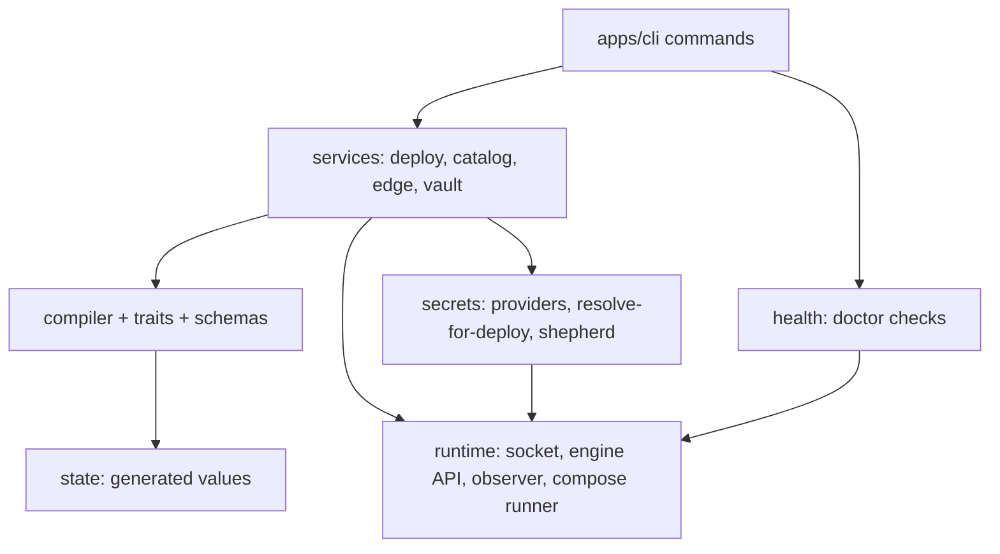

# System design — 2026-09-06

The architect's model of appbay-cli as built, derived from the code in this review. Anchors
are `[src:]` lines read this session.

## Component map

Measured import direction `[src:packages/core/src]`: `compiler → schemas, traits, state,
runtime`; `services → schemas, compiler, traits, runtime, secrets, catalog`; `health →
schemas, compiler, runtime`; `secrets → compiler, runtime, shepherd`; `runtime → schemas`.
No layer imports upward. `schemas` imports nothing.

| component | owns | talks to | does not |
|---|---|---|---|
| `apps/cli/src/commands` | argv parsing, printing, exit codes | core services through `@appbay/core` (no deep imports measured) | hold a compile or a deploy of its own; it does spawn host tools and the container CLI in 18 files (`logs`, `exec`, `pull`, `up --tail`, `init-system`, `setup`…) — see 03 F17 |
| `compiler/` | manifest meaning, every generated name (`identity.ts`), overlays, traits, plan | schemas, traits, state, `runtime/facts` | spawn a process (arch test) |
| `runtime/` | which binary, which socket, the Engine API client, the `Observer`, the compose runner, the runtime profile table | node:http over the unix socket; `spawnSync` for mutation | know what an app is |
| `services/` | deploy, catalog install, edge migration, vault, config editing | compiler, runtime, secrets | parse runtime text (last parse removed in S45) |
| `health/` | doctor checks, three-valued | runtime | be `ok` over a required unknown |
| `secrets/` | providers, master password, deploy-time resolution, shepherd payloads | runtime (volume create, shepherd run) | put a value on argv or in a render |
| `packages/db` | the web control plane's SQLite schema | `rebuild-cache` only | be source of truth |

## Journeys and the components that realise them

| journey | path | break points measured |
|---|---|---|
| **up** | `up.ts` → `deploy()` → `compileInstall` → `compile()` per app → `writeRenderedOutput` → `resolveDeployEnv` → `compose up -d` → `crashCheck` → `installRoute` → readiness wait → report | dependents not blocked on five failure kinds (F2); one-shot init services never ready (F4) `[src:services/deploy-service.ts:438-861]` |
| **init** | `init.ts` → scaffold → `ensureDockerNetwork` → `seedSystemApps` → `writeProjectConfig` → server compose → catalog seed | none this session; instance keys edited by regex `[src:apps/cli/src/commands/init.ts:713-750]` |
| **install** | `catalogInstall` → copy entry → read `vars` → vault set or `.env.local` fallback → `addSecretsTrait` | plaintext fallback (F9), catalog-name vault key (F5) `[src:services/catalog-service.ts:108-306]` |
| **edge migrate** | `edge.ts` observes the serving edge → `migrateEdge`: ports over API → validate → backup → stop → start → health → restore on failure | none after S45 `[src:services/edge-migration-service.ts:61-228]` |
| **secrets at deploy** | trait metadata → `extractSecretRefs` → by mode: env / volume via shepherd stdin / encrypted bundle + injector | `wrapper-live` unhandled (F1); injector unshipped (F11) |
| **server start** | `server.ts` → network → bind resolution → compose up → `curl` health loop | unknown-as-false (F7); host `curl` dependency |
| **doctor** | `runChecks` → per-check `status` → `buildDoctorJson` | GPU absent reads as failed not unknown (F21, optional check) |

## Decisions as built

**Observation over the API socket, mutation through the compose binary.**
Context: Docker Compose and podman-compose disagree on flags, output and labels; text
parsers existed twice. Choice: `runtime/engine-api.ts` + `Observer`; compose CLI for `up`,
`down`, `run`. Why: one typed shape on both runtimes; compose owns naming and recreate.
Alternatives: parse CLI text per runtime (rejected, S41); talk to compose's own API (none
exists). Consequences: a host without a reachable socket reports unknown for every look; the
port check was the last text parser and went in S45. Review question: should mutation move to
the API too, so the compose binary becomes optional? Not while podman-compose is the only
provider Podman documents.

**One value scope, project as a field, identity from the compiler.**
Context: four scopes confused system, project and namespace. Choice: `${{ns:KEY}}`,
`project:` as the composition unit, identity applied to every app. Why: Kun's definitions in
`docs/steering/product.md`. Alternatives: project as a scope (S40, retracted). Consequences:
`etc/namespaces/`, `etc/projects.yaml`; collections and tags are labels. Review question:
should `--namespace` also apply to apps that pin one? Today the manifest wins.

**Secrets as URIs, resolved at deploy into the compose child's environment.**
Context: values must not land in renders or argv. Choice: `vault://` and friends, one master
password, `runtime-env` default, file and bundle modes on volumes written by a shepherd
reading stdin. Why: the render stays diffable and secret-free. Alternatives: Docker/Swarm
secrets (ledger row 22, open). Consequences: the master password is itself a file on disk
(F10); the vault-unavailable path writes plaintext (F9); the highest-security mode needs a
binary nobody ships (F11). Review question: which secret tier does the product promise, and
for whom?

**Three-valued checks and reports.**
Context: reports said ok for things never looked at. Choice: `Inspection<T>` and doctor
`status: ok | failed | unknown`; `deployed` requires an observed running container and an
installed route. Why: promise 3 in product.md. Consequences: more "unknown" in output on
degraded hosts, by design. Review question: `server status` still folds unknown into "not
running" (F7).

**Runtime differences as a profile table.**
Context: Podman arrived after Docker. Choice: `RuntimeProfile` with `versionPattern`,
`systemdUnit`, `serviceAccountGrant`, `rhel` packages, socket defaults. Why: an `if runtime ==
podman` in services spreads. Consequences: the S45 bugs were all in the few places the table
did not reach (label rendering in `ps`, the unit name, SELinux labels on binds).

## Hygiene measured

| gate | result |
|---|---|
| `tsc --noEmit` both packages | clean |
| vitest | core 1107 passed, 7 skipped (platform/CLI-gated); CLI 385 passed |
| knip | 4 unused exports: `DEFAULT_PROJECT`, `withIdentity`, `parseKeePassUri`, `parseVaultUri` |
| lint | **no linter configured**; `turbo lint` runs nothing |
| `TODO/FIXME/HACK` in source | 0 |
| `as any`, `@ts-ignore` | 0 |
| tests asserting only a mock call | 2, both defensible (`docker.test.ts` pins argv; `checks-store-binding` asserts no probe) |
| docs checks | `check:docs-cli` 0 discrepancies; 58 manifests parse; system apps current |
