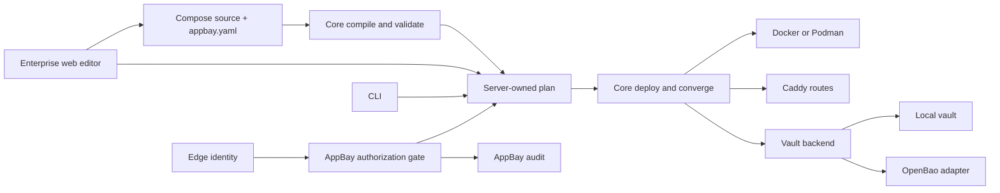

# System Design And Boundaries

Paths use `cli:` for `appbay-cli/` and `ent:` for sibling `appbay/`. These are observed paths and proposed decisions, not an activated spec.

The arrow from UI to source represents a future validated save API. The web currently writes selected `appbay.yaml` fields; it has no Compose editor. The CLI and web currently do not converge on the same core package or deploy entry point.

## Current Journeys

1. `appbay up` calls the OSS core `deploy()` through `apps/cli/src/commands/up.ts`. Core calls `compileInstall()`, which supplies project variables and runtime facts, then orders and runs convergence. `resolveDeployEnv()` resolves secret refs before Compose. Sources: `cli:packages/core/src/services/deploy-service.ts:71-185`, `cli:packages/core/src/services/compile-install.ts:22-37`, `cli:packages/core/src/services/deploy/converges.ts:62-91`.
2. The web Up button calls `deployments.up`, which compiles against the private core and runs its own `docker compose up`. The loop writes the rendered YAML but does not apply `auxiliaryFiles` or resolve secret refs. Sources: `ent:apps/web/src/components/apps/app-detail.tsx:62`, `ent:apps/web/src/server/routers/deployments.ts:185-298`.
3. The planner calls `plans.compile`, receives raw rendered YAML and auxiliary contents, then submits both to `deployments.enqueue`; the worker writes those browser-supplied bytes and invokes Compose. Sources: `ent:apps/web/src/server/routers/plans.ts:47-87`, `ent:apps/web/src/components/deploy/deploy-planner.tsx:417-425`, `ent:apps/web/src/server/queue/workers/deploy.ts:144-208`.
4. The separate `fullDeploy` route calls the private core's `deploy()` with a hard-coded Docker runner. Sources: `ent:apps/web/src/server/routers/deployments.ts:458-500`.

CodeGraph traces: `codegraph node -p /Users/kundeng/Projects/appbay-cli -f packages/core/src/services/deploy-service.ts deploy`; `codegraph node -p /Users/kundeng/Projects/appbay -f apps/web/src/server/queue/workers/deploy.ts createDeployWorker`; `codegraph callers -p /Users/kundeng/Projects/appbay createDeployWorker`. The graph links the queue worker to server startup, and OSS `deploy()` to CLI `up`, `apply`, `restart`, and `edge`. UI procedure calls were confirmed in source because the graph does not connect tRPC property calls across the client/server boundary.

## Proposed Contracts

- `@appbay/core` owns parsed manifest types, compile, plan, deploy, runtime observation, route transaction, and deployment refusal rules. An external application assembles narrow capability adapters. Published package compatibility and the Bun compiled CLI are separate release gates (`cli:apps/cli/package.json:11`). There is no automatic runtime plugin discovery in the current binary.
- A plan API returns a plan ID, source revision, expected hash, redacted preview, and diagnostics. Apply takes the plan ID and selected targets; the server checks authorization and source revision, compiles or validates the plan again, and calls one core deploy path. Rendered YAML and output paths are never accepted as authority from a browser.
- A vault backend contract covers the same logical `vault://` key across read/check/create/update/delete/list paths. The local backend retains current behavior; an optional OpenBao adapter uses install/target configuration and scoped machine credentials. `vault://` remains the manifest notation. The current implementation does not yet select a backend: `VaultSecretProvider` constructs the local `Vault` directly (`cli:packages/core/src/secrets/providers/vault.ts:449-474`), and vault CRUD does likewise (`cli:packages/core/src/services/vault-service.ts:139-164`).
- AppBay authorization uses a stable edge identity plus AppBay-managed workspace membership and action policy. The edge still owns authentication. AppBay audit records actor, action, scope, target, plan hash, decision, outcome, and time. OpenBao audit is correlated by request identity and covers access to the secret service, not app changes.
- AppBay deployment namespaces and OpenBao namespaces have different authorities. An explicit mapping may assign a workspace to an OpenBao namespace and policy. They must not be inferred from similarly named strings.
- The editor reads the operator-owned source, validates it, previews the core plan, and saves against a source revision with an atomic replace. Catalog upstream Compose is read-only; AppBay overrides remain editable. Generated renders are never edited (`cli:docs/design/data-architecture.md:50-59`).

## Data Ownership

`appbay.yaml` and upstream Compose are source of truth; renders are derived. `appbay`'s SQLite database is currently described as a cache, but a durable multi-user audit and workspace policy store cannot be rebuilt from manifests. The enterprise spec must explicitly name its authoritative store, backup, migration, and retention policy before adding those tables (`cli:docs/design/data-architecture.md:35-67`; `ent:packages/db/src/schema.ts:1-17`).

OpenBao KV v2 is the first supported external backend. Leased or dynamic credentials require a runtime renewal and refresh mechanism; the current deploy path resolves environment values once. OpenBao's [lease](https://openbao.org/docs/concepts/lease/) and [Agent template](https://openbao.org/docs/agent-and-proxy/agent/template/) documentation define the later delivery requirements.
