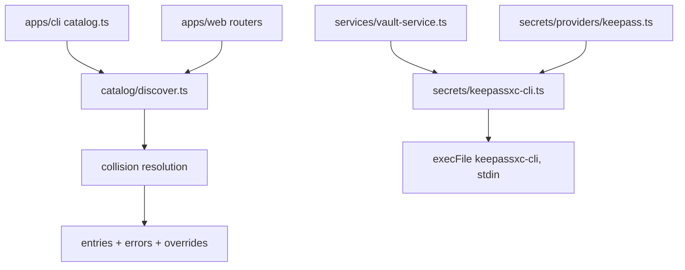
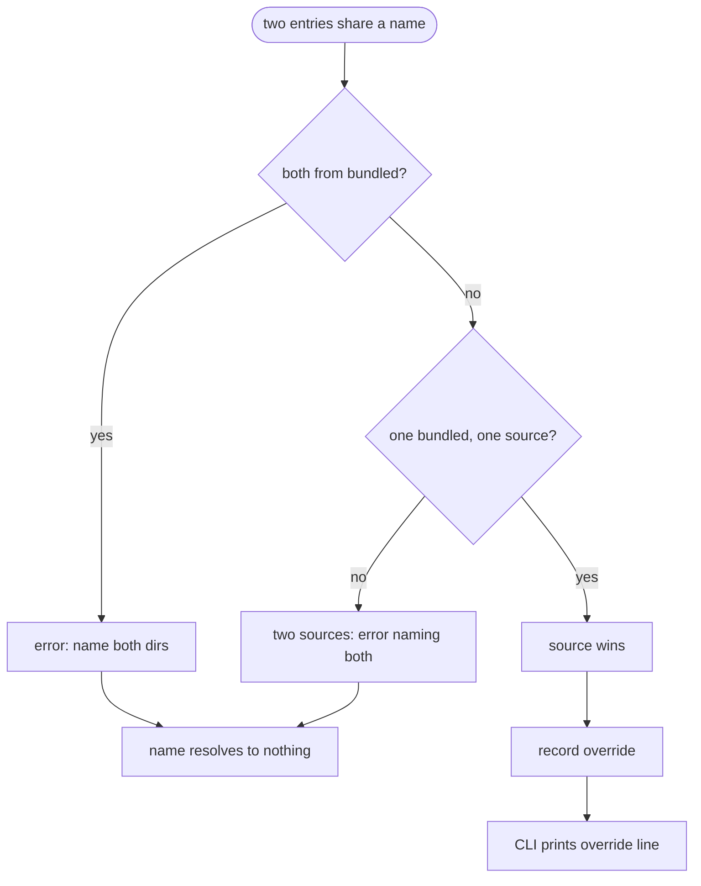
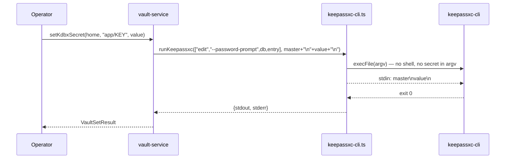
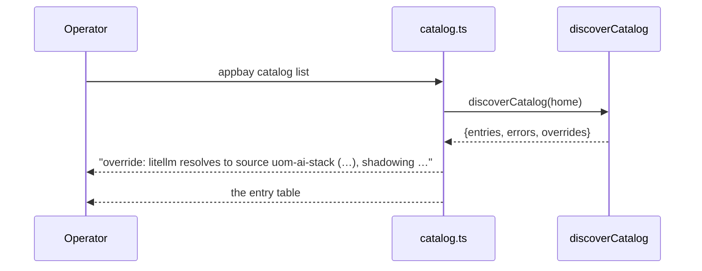

# S30: RFC-001 consolidation — the independently shippable half

<!-- ACTIVE 2026-08-31. This sprint lives in `appbay-cli/specs/`, the CLI's own queue — NOT
     in the private tree's `.kiro/specs/appbay-v1/`. See Decision 1. -->

# 1 · Requirements

## Introduction

`docs/rfc/RFC-001-consolidation.md` (upstream `8274ac1`, revision 2) specifies six areas of
consolidation: identity, system home, secrets, namespace, `when`, and catalog sourcing. Its
own Sequencing table names **two items as independently shippable** — 3.1 (the argv
disclosure) and §6 (catalog sourcing). This sprint is those two, plus the record repair that
turned out to gate them.

It is deliberately **not** the whole RFC. §1, §2, §4 and §5 are a larger, coupled change with
a data migration in it; they get their own sprint. See *Out of Scope*.

## Glossary

- **Subset / superset** — `kundeng/appbay-cli` (public) is a strict *subset* of
  `kundeng/appbay` (private) at identical paths. `public/apps/` holds only `cli`; the private
  tree adds `apps/web`. `scripts/split-boundary.json` is the authority.
- **bundled** — `var/lib/catalog/bundled`, the catalog shipped with the binary.
- **source** — `var/lib/catalog/sources/<name>`, a catalog added by `appbay catalog add-source`.
- **UOM stack** — the five-app LiteLLM/OpenWebUI stack the consuming project deploys.
  Fixtures on `llm-stack@pre-appbay-removal`, cloned locally to `~/Projects/appbay-ansible-test`.
- **argv disclosure** — a secret placed in a process's `argv`, hence in
  `/proc/<pid>/cmdline` (world-readable) and in auditd `execve` records. Distinct from
  injection: correct quoting does not fix it.

## Mental Model & Invariants

The frame, in the owner's terms:

1. **The RFC is an audit of the subset presented as an audit of the system.** Every
   "zero callers" finding was measured against a tree missing ~50k lines of consumers.
   Three such findings survive re-measurement; two do not.
2. **Removing the shell is not the same as removing the exposure.** A secret passed as a
   command-line *argument* is exposed whether or not a shell is involved. `execFile` fixes
   the sites where the secret was in the *shell's* argv; it does nothing for a site where
   the secret is an argument of the target program itself.
3. **The catalog collision is a precedence bug, not a naming bug.** Two catalogs claiming one
   name is normal; deciding it by "bundled always wins" is what makes the UOM stack lose.
4. **Priority follows the path that actually runs.** The UOM stack resolves secrets through
   `vault://` 27 times and `keepass://` zero times. Work on the KeePass path is real but not
   urgent; work on the catalog path is on the live converge.

Invariants any solution must hold:

- **I1** No secret value appears in any process's `argv`, on any path, shell or not.
- **I2** A name collision never resolves silently. It either reports which definition won, or
  it fails — never a quiet pick.
- **I3** An explicitly added source outranks a shipped one. Adding a source is an operator's
  deliberate act; shipping one is not.
- **I4** A fix measured against the public subset is not proven until it is checked against
  `apps/web`, because that is where the merge breaks.

## Decisions & Corrections (log)

**2026-08-31 — the RFC's scope blind spot.** Re-measured every "zero callers" claim against
the superset. `renderEdgeSecurityBlock`, `edgeSecretEnvMapping`, `ProjectConfigSchema`,
`EnvironmentConfigSchema` and the unjoined `"projects"` string all hold. Two do not:
`passwordHash` has nine `apps/web` consumers including the sign-in check at
`app/api/auth/[...all]/route.ts:152`, and `discoverRunningApps` has a *second implementation*
at `apps/web/src/server/docker-utils.ts:25` with two more injection sites. Recorded as ⚠️
notes on RFC work items 1.1 and 5.1.

**2026-08-31 — `SESSION-BRIEF.md` described the private repo wrongly.** It said "a **stale**
private fork — `v0.0.1-alpha.4`, last commit 2026-08-09, seven releases behind. Reconcile or
retire it." Measured: HEAD `b9c0de8` dated 2026-08-24, contains `bd32116` via merge `5ca5bd8`,
tags to `v0.0.1-alpha.9`, 3 commits ahead, and it is a superset holding `apps/web`. Acting on
"retire it" would have deleted the web UI. Corrected in place.

**2026-08-31 — owner correction on priority.** The owner challenged spending the first unit on
KeePass. Correct: measured, the UOM stack uses `vault://` 27× and `keepass://` 0×, and
`specs/26-preprod02-readiness/spec.md:246` in the fixtures says keeweb "is only relevant if
the secret store moves from `vault://` to `keepass://`." Task 2 is kept because it is done and
verified, but it is demoted from "ships first" to "ships whenever", and the RFC's claim that
§6 is *independent* is corrected — §6 is the item with a live security consequence.

**2026-08-31 — owner correction on process.** This sprint was created *after* tasks 1 and 2
were implemented. That is an EP6 violation (spec-before-code) and it is recorded here rather
than hidden by back-dating: the tasks below are marked `[x]` because the code and tests
exist, not because they were planned first.

## Configuration (config-as-code)

No new configuration keys. The one new module (`packages/core/src/secrets/keepassxc-cli.ts`)
holds its timeouts as named constants (`DEFAULT_TIMEOUT_MS`, `MAX_BUFFER`) per EP1 rather than
as literals at call sites. Catalog locations are already derived from `APPBAY_HOME`; this
sprint adds no path config.

## Requirements

### Requirement 1: No secret reaches an argv

**User Story:** As an operator running a non-interactive converge on a shared host, I want
credential-seeding to leave no trace in process metadata, so that any local user reading
`/proc` or auditd cannot recover a secret.

#### Acceptance Criteria

1. WHEN any KeePass operation runs, THE core SHALL invoke `keepassxc-cli` via `execFile` with
   an argv array and no shell.
2. WHEN a secret value must be supplied to `keepassxc-cli`, THE core SHALL write it to the
   child's stdin and SHALL NOT pass it as a command-line argument.
3. IF a `keepassxc-cli` subcommand offers no stdin path for a value, THE core SHALL use the
   subcommand's prompt variant rather than its argument variant.

### Requirement 2: A catalog collision is never silent

**User Story:** As an operator who added a catalog source, I want to know when it replaced a
shipped app, so that a definition swap cannot change my host's security posture unnoticed.

#### Acceptance Criteria

1. WHEN an added source and `bundled` declare the same name, THE catalog SHALL resolve to the
   added source's entry.
2. WHEN an added source overrides a bundled entry, THE CLI SHALL print the name, the winning
   source, and both directories.
3. WHEN two added sources declare the same name, THE catalog SHALL emit an error naming both
   directories and SHALL resolve that name to no entry.
4. WHEN the bundled catalog declares one name in two directories, THE catalog SHALL emit an
   error naming both directories.
5. WHEN entries are deduplicated, THE catalog SHALL key on the `name` inside `catalog.yaml`,
   not on the directory name, and every collision message SHALL name the directory.

### Requirement 3: The record matches the system, not the subset

**User Story:** As the next agent picking up RFC-001, I want the brief to describe the repos
as they are, so that I do not delete the web UI or land a change that breaks the merge.

#### Acceptance Criteria

1. THE brief SHALL describe `kundeng/appbay` as a current superset, with its measured HEAD.
2. WHERE an RFC work item's blast radius extends outside the public subset, THE RFC SHALL
   carry a note naming the external consumers.
3. THE RFC SHALL record which zero-caller findings were re-measured against the superset and
   which held.

### Non-Functional

- **NF 1 (security)** — I1 holds on every path, including error paths.
- **NF 2 (compatibility)** — `discoverCatalog`'s result gains a field; existing destructuring
  consumers keep working.
- **NF 3 (boundary)** — every commit in this sprint is public-set only; `check-straddle.mjs`
  exits 0.

## Out of Scope

Deferred to a successor sprint, each with a destination:

- RFC §1 (identity/password collapse), §2 (system home), §4 (namespace), §5 (`when`) —
  `[>] → S32-rfc-001-core` (DRAFT). ⚠️ S31 is taken by the PRIVATE queue's
  `S31-alpha-remainder`; numbers are one global sequence across both queues, so the CLI's
  next is S32.
- RFC 2.5 (the constant `SCRYPT_SALT`) — a vault file-format migration, needs its own sprint.
- RFC 3.2/3.3 (narrowing the manifest `provider:` enum, routing `*-kdbx` through the neutral
  commands) — the RFC sequences these after §2. `[>] → S32-rfc-001-core`.
- The Ansible-native deployment path for the UOM stack — a separate track on
  `llm-stack@main`, per `SESSION-BRIEF.md`.

---

# 2 · Design

## End-to-End Walkthrough

Two journeys, unrelated except that both are RFC-001.

**Journey A — an operator seeds a credential into KeePass on a shared host.** They run
`appbay secrets set-kdbx`, or a converge does. Before: core built a string
`echo '<master>' | keepassxc-cli edit --password '<secret>' …` and handed it to `/bin/sh -c`,
so both the master and the stored secret sat in the shell's `/proc/<pid>/cmdline` for the life
of the call. After: core calls `execFile("keepassxc-cli", [...])` with no shell, and writes
`master\nsecret\n` to the child's stdin. Nothing composed, no shell, no secret in any argv.

**Journey B — an operator adds the UOM catalog as a source.** They run
`appbay catalog add-source uom-ai-stack <url>`, then `appbay catalog list`. `discoverCatalog`
scans `bundled` (150 upstream apps) then each source (5 UOM apps). Two names — `litellm` and
`portainer` — exist in both. Before: bundled won silently, so the operator got upstream's
LiteLLM (which declares the provider credential as a `required_input`, forcing it through
`--set KEY=VALUE` on a non-interactive converge) and upstream's Portainer (which mounts the
Docker socket and declares no auth trait) while believing they had their own. After: the added
source wins, and the CLI prints one `override:` line per replaced name.

## Tech Stack

- **Language**: TypeScript (Node/Bun), ESM
- **Testing**: vitest
- **Build**: `tsc` via turbo; `pnpm -r --filter @appbay/core build`
- **Test command**: `pnpm -r test`
- **Straddle gate**: `node scripts/check-straddle.mjs`

## Directory Structure

```
packages/core/src/
  secrets/
    keepassxc-cli.ts              # NEW — the only keepassxc-cli invoker
    providers/keepass.ts          # rewired
  services/
    vault-service.ts              # rewired
    __tests__/kdbx-crud.test.ts   # NEW
  catalog/
    discover.ts                   # collision rule
    __tests__/discover.test.ts    # NEW
apps/cli/src/commands/catalog.ts  # reportOverrides()
docs/rfc/                         # shared with the public repo
```

## Architecture Overview



## Workflow



## Module Design

### `secrets/keepassxc-cli.ts` (new)

- **Purpose**: the single place that runs `keepassxc-cli`, and it never uses a shell.
- **Interface**:
  ```ts
  export function stdinLines(...values: string[]): string
  export function runKeepassxc(args: string[], stdin?: string, timeoutMs?: number): Promise<KeepassxcResult>
  ```
- **Dependencies**: `node:child_process` only.

### `catalog/discover.ts` (changed)

- **Purpose**: resolve every catalog entry, and decide collisions by precedence rather than
  by scan order.
- **Interface**: `discoverCatalog(appbayHome) → { entries, errors, overrides }`
- **Dependencies**: `CatalogEntrySchema`.

## Key Algorithms (pseudo-code)

```
ALGORITHM resolveCollisions
  input:  entries (bundled scanned first, then each source)
  output: deduped entries, errors, overrides
  1. seen ← {}, overrides ← [], ambiguous ← {}
  2. for each entry:
       existing ← seen[entry.name]
       if not existing: seen[entry.name] ← entry; continue
       if existing is bundled and entry is source:
            overrides += (name, entry.source, entry.dir, existing.dir)
            seen[entry.name] ← entry            # I3: explicit beats shipped
       else if existing is source and entry is bundled:
            overrides += (name, existing.source, existing.dir, entry.dir)
       else:                                    # both bundled, or both sources
            errors += message naming BOTH directories
            ambiguous += entry.name             # I2: no silent pick
  3. remove every ambiguous name from seen
  4. return sort(seen.values()), errors, overrides
```

## Sequence Diagrams





## Error Handling Strategy

- `runKeepassxc` rejects on non-zero exit or timeout, matching what the `execAsync` call sites
  already expected. The child's stdin `error` event is swallowed deliberately: a child that
  exits before reading raises EPIPE, which would otherwise mask the real exit status.
- Catalog collisions between peers are `errors`, not exceptions — `discoverCatalog` returns
  them so a caller can print all of them rather than dying on the first.

## Testing Strategy

- **System/E2E**: `kdbx-crud.test.ts` drives the real `keepassxc-cli` through the exported
  service functions. Not mocked, deliberately — a mock asserts the argv shape this code
  builds, and the argv shape was never the thing that was wrong (`edit --password` looked
  entirely plausible and the binary rejects it).
- **Integration**: `discover.test.ts` builds real catalog trees on disk under `mkdtemp`.
- **Fixture-grounded probe**: the §6 move run against the real 150-app `appbay-catalog` and
  the real 5-app UOM catalog, asserting which definition wins.
- **Loud skip**: when `keepassxc-cli` is absent the suite writes to `process.stderr` and
  reports *skipped*, never passed. `console.warn` does not survive a fully-skipped file.
- **Test command**: `pnpm -r test` · **Straddle**: `node scripts/check-straddle.mjs`

## Constraints

- Every commit is public-set only (`packages/core/`, `apps/cli/`, `docs/rfc/` is shared).
  A straddling commit cannot be cherry-picked upstream.
- `docs/rfc/` must stay byte-identical between the two repos.

## Correctness Properties

### Property 1: no secret in argv
- **Statement**: *For any* KeePass operation carrying a secret, the spawned process's argv
  contains neither the master password nor the stored value.
- **Validates**: Requirement 1.1, 1.2, 1.3
- **Test approach**: by construction (`execFile` + stdin, no `--password <value>` argument
  anywhere) plus the round-trip test proving the stdin path actually works.

### Property 2: explicit beats shipped, visibly
- **Statement**: *For any* name declared by both `bundled` and an added source, the resolved
  entry is the source's, and exactly one override record names both directories.
- **Validates**: Requirement 2.1, 2.2
- **Test approach**: `discover.test.ts` "lets an added source override bundled, and reports it".

### Property 3: peer collisions resolve to nothing
- **Statement**: *For any* name declared by two added sources, the name is absent from
  `entries` and an error names both directories.
- **Validates**: Requirement 2.3, 2.4
- **Test approach**: `discover.test.ts` "errors on a collision between two added sources".

## Edge Cases

- A value containing shell metacharacters (`$(id)`, backticks, quotes, backslash) must
  round-trip byte-exact — covered.
- A value with trailing whitespace must not be trimmed by the newline handling — measured.
- `db-create --set-password` prompts **twice**; a single line fails with "Passwords do not
  match."
- An ambiguous name must not suppress unaffected neighbours in the same source — covered.
- `keepassxc-cli` absent → loud skip, not a pass.

## Decisions

### Decision 1: this sprint belongs to `appbay-cli`, not to the private queue

**Context:** RFC-001 states `Scope: appbay-cli`, and every file this sprint touches is
public-set. The private tree's `.kiro/specs/appbay-v1/` queue runs to S29-issue-burndown. The
first draft of this spec was written into that private queue, which was wrong on two counts:
it recorded CLI work where the CLI code does not live, and it forced a false lifecycle
conflict — S29 is ACTIVE, so an S30 in the same queue would have violated the activation gate.

**Options:**
1. `.kiro/specs/appbay-v1/S30-…` in the private tree — Pros: one queue. Cons: the sprint
   record cannot travel upstream with the code it governs, because `.kiro/` is private-set;
   the public repo would hold the code and none of the reasoning. Also collides with S29.
2. `appbay-cli/specs/S30-…`, declared public-set — Pros: the record ships with its code and
   cherry-picks alongside it; no lifecycle collision, because the two queues are separate
   scopes. Cons: two spec roots in the private tree, which must be explained or someone will
   "fix" it.

**Decision:** Option 2 (owner's instruction: *"s30 does belong here"*). `specs/` is added to
the `public` list in `scripts/split-boundary.json`, with a `$comment` paragraph explaining why
`specs/` is public while `.kiro/` is private — they are two queues for two scopes, not an
inconsistency. **Rationale:** the sprint record is documentation *of the public code*; keeping
it private would leave the repo that holds the code with no account of why it changed.

**Consequence for S29:** the two queues no longer contend, so nothing about S30 blocks it.
S29 is the private product's sprint and is closed FORK-FORWARD on its own terms — its
remaining work (#75 cert issuance, #69/#76 UI surfaces) is `apps/web` and journeys, none of it
this sprint's, and it is carried to a named successor rather than left ACTIVE and unattended.

### Decision 2: source overrides bundled, rather than prefixing the UOM apps

**Context:** RFC 6.2 offers two ways to stop the silent swap: prefix every UOM app
(`uom-litellm`) or let an added source override `bundled`.

**Options:**
1. Prefix — Pros: no core change. Cons: renames apps a live deployment already refers to;
   every manifest, `when:` clause and operator habit changes; and it fixes one stack rather
   than the rule.
2. Override — Pros: fixes the precedence bug for everyone; no rename. Cons: changes resolution
   for any existing home where a source happens to shadow a bundled app.

**Decision:** Option 2. **Rationale:** the collision is a precedence bug, not a naming bug.
The cons are bounded by making every override *reported* (Requirement 2.2), so the changed
resolution is visible rather than a second silent swap.

### Decision 3: `edit --password-prompt`, not `execFile` with `--password`

**Context:** RFC 3.1 says to replace all six sites with `execFile` plus stdin.

**Decision:** For five sites that is sufficient. For `vault-service.ts` `edit`, it is not:
`--password` takes the secret as an *argument*, so `execFile` alone would move it from
`/bin/sh`'s argv into `keepassxc-cli`'s. Used `--password-prompt` + stdin instead.
**Rationale:** Invariant I1 is about argv, not about shells. Measured bonus: `keepassxc-cli
edit` has no `--password` option at all — the old command died with `Unknown option
'password'.`, so this path had never worked.

## Security Considerations

- The sprint's whole first half is a disclosure fix; see Property 1.
- ⚠️ **Cross-item coupling the RFC does not record.** RFC §6.3's catalog move *reintroduces*
  argv disclosure on the live path: upstream's `litellm` declares three `type: secret`
  `required_inputs`, `install.ts:90` refuses them on a non-TTY, and the only escape is
  `--set KEY=VALUE` (`install.ts:9`), which is argv. The UOM manifest declares
  `required_inputs: []` explicitly to avoid exactly this. So §6.2 is a **security gate on
  §6.3**, not the independent nicety the RFC's Sequencing table calls it.
- Upstream's `portainer` mounts the Docker socket and declares no auth trait; the UOM one
  proxies it read-only with `POST=0 EXEC=0` behind an admin group. The silent swap was a
  privilege escalation.

---

# 3 · Tasks

## Status marks
<!-- [ ] pending | [x] done | [!] BLOCKED: reason | [ ]* optional
     [-] DROPPED: <reason> | [>] → <spec_id> -->

## Tasks

- [x] 1. Reconcile the record with the system
  - [x] 1.1 Re-measure every RFC "zero callers" claim against the superset
    - Three hold (`renderEdgeSecurityBlock`, `edgeSecretEnvMapping`, `ProjectConfigSchema` /
      `EnvironmentConfigSchema`); two do not (`passwordHash`, `discoverRunningApps`).
    - **Depends**: — · **Requirements**: 3.3 · **Pillar**: Design
  - [x] 1.2 Correct `SESSION-BRIEF.md`'s description of the private repo
    - Replaced the "stale fork, retire it" row; added a *What this repo cannot see* section.
    - **Depends**: 1.1 · **Requirements**: 3.1
  - [x] 1.3 Add ⚠️ blast-radius notes to RFC work items 1.1, 1.2 and 5.1, plus a scope notice
    - **Depends**: 1.1 · **Requirements**: 3.2
  - [x] 1.4 Delete the superseded revision-1 draft `docs/rfc-001-consolidation.md`
    - **Depends**: — · **Requirements**: 3.2

- [x] 2. RFC 3.1 — argv containment (demoted from "ships first"; see the 2026-08-31 correction)
  - [x] 2.1 Add `packages/core/src/secrets/keepassxc-cli.ts`
    - `execFile` + argv array + stdin; `stdinLines()` terminates every line.
    - **Depends**: — · **Requirements**: 1.1, 1.2 · **Properties**: 1 · **Pillar**: MVP
  - [x] 2.2 Rewire `providers/keepass.ts` and `services/vault-service.ts` (all 8 invocations)
    - **Depends**: 2.1 · **Requirements**: 1.1, 1.2
  - [x] 2.3 Use `edit --password-prompt` rather than `--password <value>`
    - `execFile` alone would have moved the secret into keepassxc-cli's own argv; and the
      option does not exist, so the path had never worked.
    - **Depends**: 2.2 · **Requirements**: 1.3 · **Properties**: 1
  - [x] 2.4 Send the password twice to `db-create --set-password`
    - It prompts enter-then-repeat; one line failed with "Passwords do not match."
    - **Depends**: 2.2 · **Requirements**: 1.1
  - [x] 2.5 `kdbx-crud.test.ts` — 6 tests against the real binary, with a loud skip
    - **Depends**: 2.3, 2.4 · **Properties**: 1 · **Pillar**: Test

- [x] 3. RFC §6 — catalog sourcing
  - [x] 3.1 Replace the bundled-wins rule with precedence resolution (6.2, 6.5, 6.6)
    - Three collision classes, three outcomes; `overrides` added to the result.
    - **Depends**: — · **Requirements**: 2.1, 2.3, 2.4, 2.5 · **Properties**: 2, 3
  - [x] 3.2 Report overrides from `appbay catalog list` and `catalog search`
    - **Depends**: 3.1 · **Requirements**: 2.2 · **Properties**: 2
  - [x] 3.3 `catalog/__tests__/discover.test.ts` — 8 tests, the module had none
    - **Depends**: 3.1, 3.2 · **Properties**: 2, 3 · **Pillar**: Test
  - [x] 3.4 RFC 6.1 — `--catalog` registers a source instead of writing `bundled`
    - `bundled` is now written only from the baked path or `DEFAULT_CATALOG_URL`; an operator
      catalog registers as the source `local`. `catalogAddSource` gained local-path support —
      it could only `git clone`, so the one caller that matters (a directory from
      `provision-appbay.yml`) could not use it. Verified end to end against the real
      fixtures: `bundled(150), local(5)`, all five UOM apps resolve to the operator's, both
      collisions reported, and upstream's catalog installed for the first time.
    - **Depends**: 3.1 · **Requirements**: 2.1 · **Pillar**: MVP
  - [x] 3.5 RFC 6.4 — `--catalog` on a seeded home must not silently no-op
    - Registration now runs regardless of the seed result. +5 tests covering local-path
      registration, `bundled` left byte-untouched, no accumulation on re-run, and a
      non-directory still treated as a URL.
    - **Depends**: 3.4 · **Pillar**: Test
  - [x] 3.6 RFC 6.7 — surface `openwebui` vs `open-webui`
    - Once the operator's catalog is a source, both resolve: not a collision, so nothing
      fired. `discoverCatalog` now returns `nearDuplicates` (case + `-`/`_` folding) and both
      `catalog list` and `catalog search` print them. Normalization measured over all 155
      real entries: exactly ONE group, the real case.
    - NOT renaming and NOT adding an `aliases` field. Which name wins is a catalog-CONTENT
      decision that breaks either the UOM manifests or upstream's convention, and an unused
      schema field is a speculative flag. Made visible so the decision can be deliberate.
    - **Depends**: 3.4 · **Requirements**: 2.5 · **Properties**: 2

- [ ] 4. Verification against the real deployment scenario
  - [x] 4.1 Clone the fixtures to `~/Projects/appbay-ansible-test`
    - `llm-stack@pre-appbay-removal`; confirmed `provision-appbay.yml:692` and the five
      catalog entries match the RFC's citations.
    - **Depends**: — · **Pillar**: Test
  - [x] 4.2 Reproduce the silent swap, then prove the fix, against the real catalogs
    - Before: `litellm` and `portainer` resolved to bundled. After: all five resolve to
      `uom-ai-stack`. 10 upstream entries fail to parse either way, matching the RFC.
    - **Depends**: 3.1, 4.1 · **Properties**: 2
  - [x] 4.3 Move the keepassxc verification into `appbay-docker`; host restored
    - ⭐ The VM ships keepassxc **2.7.6**, the host had **2.6.6**, which made this a stronger
      check than intended: the fix was derived from 2.6.6 and had to be shown not to be tuned
      to one build. On 2.7.6, identically — `edit` offers only `--password-prompt` and has no
      `--password <value>`; single-line `db-create` still fails ("Failed to set database
      password"); two lines succeed; the full round trip returns s3cret-v1 then s3cret-v2.
      Both defects and both fixes are version-portable.
    - `keepassxc` purged from the host. The vitest suite now skips there — loudly, printing
      "The KeePass CRUD round trip was NOT verified by this run", counted as 6 skipped.
    - ⚠️ The VM has no node/bun toolchain, so the vitest suite itself cannot run there without
      provisioning one. What was moved is the part that needed a VM: the package install and
      the external contract. Running the packaged binary in a VM is 4.4.
    - **Depends**: 2.5, 3.3 · **Pillar**: Test
  - [>] 4.4 → S30 release · Verify a converge path end-to-end with `catalog add-source`
    - The logic is verified end to end against the real fixtures through the real
      registration path (4.2). What is left is the PACKAGED BINARY on a host: build a release
      tag, point `appbay_release_tag` at it, re-converge, and read `appbay catalog list` back.
      That is the release step the RFC already prescribes ("each landed group gets a release
      tag"), not a code task — it cannot run until a tag exists.
    - **Depends**: 3.4, 4.3

- [ ] 5. Land it
  - [x] 5.1 Establish `appbay-cli/specs/` as the CLI's sprint queue
    - `specs/` added to the `public` list in `scripts/split-boundary.json`, with a `$comment`
      paragraph explaining the `specs/`-public vs `.kiro/`-private split. Both repos' copies
      of the boundary file now agree except the one private entry that already differed.
    - **Depends**: — · **Requirements**: 3.1 · **Pillar**: Design
  - [x] 5.2 Close S29 in the private tree FORK-FORWARD, carrying #75/#69/#76 to a successor
    - S29 `CLOSED`/`FORK-FORWARD`, `superseded_by: S31-alpha-remainder`; every open item
      carries a `[>]` to it and no bare `[ ]` remains. `S31-alpha-remainder` created DRAFT.
      Private queue now has 0 ACTIVE. Not this sprint's work — done so the private queue is
      not left with an unattended ACTIVE.
    - **Depends**: 5.1
  - [x] 5.3 Commit the `docs/rfc/` corrections and this spec in `appbay-cli`
    - **Depends**: 1.4, 5.1
  - [x] 5.4 Commit tasks 2 and 3 in the private tree as public-set commits; straddle exits 0
    - **Depends**: 2.5, 3.3
  - [x] 5.5 `git merge upstream/main` into the private tree so it carries the RFC
    - **Depends**: 5.3
  - [x] 5.6 Cherry-pick the public-set code commits upstream
    - **Depends**: 5.4, 5.5
  - [x] 5.7 Open `S32-rfc-001-core` as DRAFT in `appbay-cli/specs/`, holding the deferred sections
    - Destination for every `[>]` in *Out of Scope*.
    - **Depends**: 5.6

## Notes

**Pillar balance:** MVP (tasks 2, 3), Test (2.5, 3.3, 4.x — two modules that had zero
coverage now have 14 tests), Design (task 1 — the record now matches the system). Docs pillar
is untouched; `docs/guide/` says nothing about catalog precedence yet and should before close.

**Verification standard for this sprint:** a task is done when it has run, not when it
compiles. Both functional bugs in task 2 were invisible to reading and to `tsc`, and were
found only by executing the real command shapes.

## Log

**2026-08-31 (b)** — Owner caught two placement errors. The sprint had been written into the
private tree's `.kiro/specs/appbay-v1/`, where CLI work does not belong and where it collided
with the ACTIVE S29; moved to `appbay-cli/specs/` and `specs/` declared public-set. Decision 1
rewritten — the parallel-ACTIVE reasoning it originally carried was solving a conflict that
only existed because the spec was in the wrong queue.

**2026-08-31 (a)** — Sprint opened *after* tasks 1 and 2 were already implemented (EP6 violation,
recorded in Decisions & Corrections rather than hidden). Upstream `8274ac1` pulled; RFC read;
superset re-measurement done; 3.1 implemented and verified against keepassxc-cli 2.6.6;
catalog collision rule implemented and verified against the real 150-app upstream catalog and
the real UOM fixtures. Full suite green: core 52 files / 847 tests, web 25 / 474, cli pass.
Two functional bugs found in the KeePass path that the RFC did not know about
(`db-create` single-line, `edit --password` nonexistent). Owner corrected the priority
framing: §6 is the live-path item, not §3.1.
