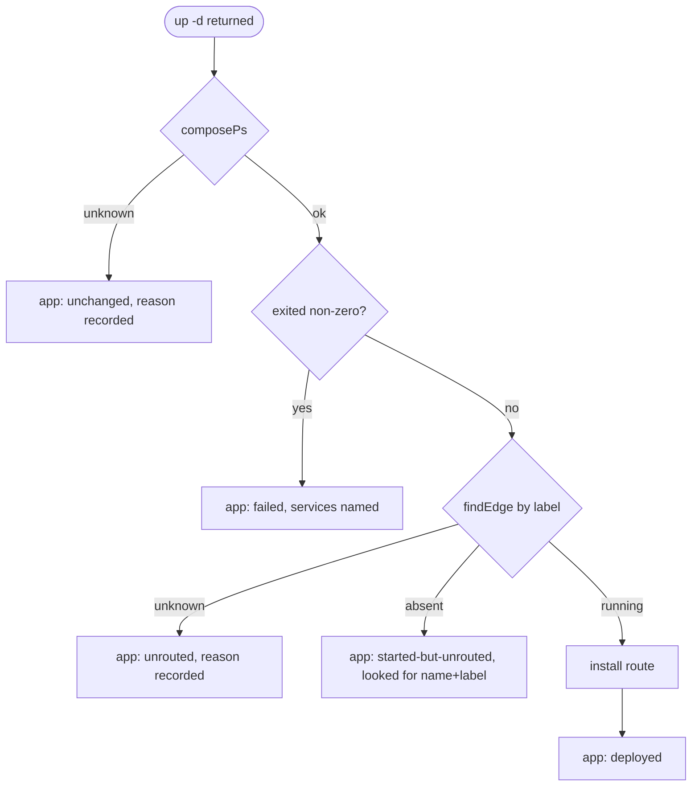

# S36: hardening — every reported outcome was observed

<!-- YAML is the source of truth; edit it only via /spec-plan. -->

# 1 · Requirements

## Introduction

The 2026-09-05 review found one live P1 and eight smaller defects of one shape: a command
reports an outcome it did not look at. This sprint fixes the ones the review marked FIX NOW,
adds the test that would have caught the P1, and re-runs the deploy journey. It changes
behaviour and nothing else; moves and renames wait for S37.

## Glossary

- **edge**: the reverse-proxy system app (caddy or traefik) that fronts every ingress route.
- **observe**: read the runtime after acting, through one adapter function, and carry
  "could not read" as its own value.
- **Inspection**: the result type for an observation: `ok` with a value, or `unknown` with
  the reason.

## Mental Model & Invariants

- `deployed` means: the container is running and its route is installed on an edge that
  exists. Anything less is `started-but-unrouted` or `unknown`, printed as such.
- The edge is found by the name identity generates or by the app label, never a literal.
- `unknown` is never collapsed into a verdict, in the crash detector, in doctor, in the
  port check.
- There is one deploy path. `apply` is a caller of it or is gone.
- No CLI command spawns a literal `docker`.

## Decisions & Corrections (log)

- 2026-09-05 — Kun: `when:` is collection membership, not "installed in the home". Out of
  scope here; carried by the collection sprint. Recorded in `docs/steering/product.md`.
- 2026-09-05 — the traefik route path gets an observation too (the edge container exists
  and is running), not a validate-and-reload, because traefik watches the dynamic dir.

## Configuration

No new keys. `APPBAY_INGRESS_PROVIDER` and `etc/system.yaml: ingress_provider` already
select the edge; the fix reads them through `resolveIngressProvider`.

## Requirements

### Requirement 1: the edge is resolved through identity (review F0, ledger 13)
1.1 WHEN the deploy path needs the edge container, THE runtime adapter SHALL return the
    container whose `com.appbay.app` label is the provider name, or `unknown` with the
    runtime's error.
1.2 THE literal pair `appbay.caddy.caddy`/`appbay.caddy` SHALL not exist in
    `deploy-service.ts`, `edge-identity-service.ts`, or `setup.ts`.
1.3 WHEN the edge is absent, THE message SHALL name the container it looked for by its
    generated name and the label it filtered on.

### Requirement 2: unknown is a value (review F3, F4, F6; ledger 1, 11, 17, 18)
2.1 THE functions `composePs`, `findCrashedServices`, `snapshotContainers`, `didConverge`
    SHALL return `Inspection<T>`; no `| null` meaning unknown remains in that file.
2.2 WHEN an inspection is `unknown`, THE app result SHALL carry the reason and the app
    SHALL be counted `unchanged`, never `deployed`.
2.3 THE doctor check result SHALL be three-valued; `buildDoctorJson.ok` SHALL be false when
    any required check is unknown.
2.4 WHEN `inspectEdgePorts` cannot run `ps`, THE migration SHALL refuse with that reason.

### Requirement 3: the route is observed on both providers (review F1)
3.1 WHEN the provider is traefik, THE deploy path SHALL confirm the edge container exists
    and is running before counting an app deployed; a missing edge is `started-but-unrouted`.

### Requirement 4: one deploy path (review F2, ledger 14)
4.1 `appbay apply` SHALL call `deploy()`; its own `up -d` loop is deleted.

### Requirement 5: the runtime binary is never literal (review F8, ledger 16)
5.1 THE twelve `"docker"` invocations SHALL go through `cliContainerBin()`; `dive` SHALL
    mount the socket `resolveRuntimeSocket` returns.
5.2 THE three `findOllamaContainer` copies SHALL be one function in core.

### Requirement 6: install and update tell the truth (review F5, F7)
6.1 WHEN validation fails, `appbay install` SHALL exit 1 and print the failure; it SHALL
    not print "ready to deploy".
6.2 `appbay update` SHALL read `spawnSync().status` and print `failed` on non-zero.

### Requirement 7: the safe edge migration is reachable (issue #7, review F19)
7.1 `appbay edge migrate --to <provider>` SHALL call `migrateEdge()`; `init`'s advice for
    a provider change SHALL name that command.

### Requirement 8: verification (review F17, F18; ledger 20)
8.1 A test SHALL compile the caddy system app and assert the deploy path's edge lookup
    matches its rendered `container_name`.
8.2 `keepassxc-cli.test.ts` SHALL skip its `/proc` assertion off Linux, naming the reason.
8.3 `s29-journey-deploy-reporting.sh` SHALL pass on a Docker host. A Podman run is required
    to close SHIPPED; without a Podman host the sprint closes FORK-FORWARD naming it.

### Non-Functional
- **NF 1** — no function moves between files in this sprint (S37 owns moves), so every
  diff reads as a behaviour change.
- **NF 2** — `instance.ts:92`'s "compose project prefix" comment is corrected: nothing sets
  one; the compose project is the app directory.

## Out of Scope
- Ownership moves, comment hygiene, dead code (S37).
- `when:` as collection membership (the collection sprint).
- The default-host proposal (ledger row 10) — open human decision R4.
- Socket-based observation (R7).

# 2 · Design

## End-to-End Walkthrough

An operator runs `appbay up whoami` on a caddy install. `deploy()` compiles, runs
`compose up -d`, and asks the runtime adapter for the project's containers. The adapter
returns `Inspection<ComposePsRow[]>`. If `ok`, the crash detector lists exited services; if
`unknown`, the app result records the reason and the app is counted unchanged with a line
that says compose could not be asked. Route install asks the adapter for the edge by label
`com.appbay.app=caddy`; it gets `appbay.system.caddy.caddy`, execs `caddy validate` then
`reload`, and only then counts the app deployed. On traefik, the same lookup by label
`com.appbay.app=traefik` confirms the edge is running; the fragment is already on disk and
traefik loads it. `doctor --json` reports `ok: false` if any required check could not run.

## Architecture Overview

```mermaid
graph TD
  UP[cli up / apply] --> DEP[deploy()]
  DEP --> CMP[compile()]
  DEP --> RT[runtime: composePs, findEdge]
  DEP --> ROUTE[installRoute(provider)]
  ROUTE --> RT
  DOC[cli doctor] --> HLT[checks: three-valued]
  HLT --> RT
```

## Workflow



## Module Design

### `runtime/container-runtime.ts` (additions only; moves are S37)
```ts
export type Inspection<T> = { kind: "ok"; value: T } | { kind: "unknown"; reason: string };
export function findContainerByLabel(label: string, value: string, appbayHome?: string): Inspection<{ name: string; running: boolean } | null>;
```
`findContainerByLabel` runs `ps -a --filter label=<label>=<value> --format {{.Names}}\t{{.State}}`
through `RuntimeProfile`; both providers accept the filter (verified on Docker this
session; Podman from its documentation, to be confirmed on the journey run).

### `services/deploy-service.ts`
- `composePs`, `findCrashedServices`, `snapshotContainers`, `didConverge` return `Inspection`.
- `runCaddyCommand` takes the edge from `findContainerByLabel(APP_LABEL, "caddy")`.
- new `confirmTraefikEdge()` used when `resolveIngressProvider() === "traefik"`.
- `AppDeployResult` gains `unknownReason?: string`.

### `health/checks.ts`
- `HealthCheckResult.passed: boolean` becomes `status: "ok" | "failed" | "unknown"`.
  `passed` stays as a derived getter for one release so `doctor.ts` printing does not change shape.
- `buildDoctorJson.ok = !checks.some(c => c.required && c.status !== "ok")`.

### `apps/cli`
- `apply.ts` calls `deploy()`.
- `edge.ts` gains `migrate --to <provider>`.
- `cliContainerBin()` at the twelve sites; `findOllamaContainer` moves to core.

## Key Algorithms

```
ALGORITHM findEdge(provider)
  input:  provider ∈ {caddy, traefik}
  output: Inspection<{name, running} | null>
  1. rows ← runtime.ps(all=true, filter label com.appbay.app=provider)
  2. if ps failed → unknown(stderr)
  3. if no rows → ok(null)
  4. return ok({name: rows[0].name, running: rows[0].state == "running"})
```

## Sequence Diagram

```mermaid
sequenceDiagram
  participant CLI
  participant Deploy
  participant Runtime
  participant Edge
  CLI->>Deploy: up(app)
  Deploy->>Runtime: compose up -d
  Deploy->>Runtime: composePs
  Runtime-->>Deploy: Inspection<rows>
  Deploy->>Runtime: findContainerByLabel(app=caddy)
  Runtime-->>Deploy: Inspection<{name, running}>
  Deploy->>Edge: exec <name> caddy validate; reload
  Edge-->>Deploy: status
  Deploy-->>CLI: deployed | started-but-unrouted | unknown(reason)
```

## Error Handling Strategy
Unknown propagates as a value to the tally line and to `AppDeployResult.unknownReason`.
Nothing throws across the runtime boundary.

## Testing Strategy
- **Unit**: `Inspection` arms for each of the four functions; `findEdge` against a fake
  runner returning the podman banner form and the docker NDJSON form.
- **Compile-then-target** (8.1): compile `caddy` from `SYSTEM_APPS`, assert
  `containerName("system","caddy","caddy")` equals the rendered `container_name`, and that
  the deploy path's lookup uses the label, not a literal.
- **Journey**: `s29-journey-deploy-reporting.sh` on Docker (local OrbStack or a VM), and
  on Podman when a host exists.
- Test command: `pnpm turbo test`. Lint: `pnpm -r exec tsc --noEmit`.

## Correctness Properties
### Property 1: no verdict from unknown
- **Statement**: for any inspection that is `unknown`, the app is counted `unchanged` and
  never `deployed` or `failed`, and the reason is present in the result.
- **Validates**: 2.2
### Property 2: the edge lookup tracks identity
- **Statement**: for any namespace the system apps declare, the container the deploy path
  execs into is the one `containerName()` produced for it.
- **Validates**: 1.1, 8.1

## Edge Cases
- Two containers carry the label (a migration in flight): take the running one; if both
  run, `unknown("two edges")`, since ambiguity is an error (stackbay L-rule).
- Podman rejects `ps -a` on `compose`; the plain `ps` on the runtime binary accepts `-a`.

## Decisions
### Decision: label lookup rather than `containerName()` for the edge
**Context:** the system apps' namespace is a manifest fact the deploy path would have to
re-derive. **Options:** compute the name via identity; ask the runtime by label.
**Decision:** by label. **Rationale:** the label is stamped by the compiler from the same
identity module, and the lookup keeps working if the namespace changes again.

# 3 · Tasks

## Status marks
<!-- [ ] pending | [x] done | [!] BLOCKED: reason | [-] DROPPED: <reason> | [>] → <spec_id> -->

## Tasks

- [ ] 1. Foundation
  - [x] 1.1 `Inspection<T>` and `findContainerByLabel` in `runtime/container-runtime.ts`, with unit tests for both providers' output shapes
    - **Depends**: — · **Requirements**: 1.1, 2.1 · **Pillar**: Correct
  - [x] 1.2 Compile-then-target test (fails against the literal)
    - **Depends**: 1.1 · **Requirements**: 8.1 · **Properties**: 2 · **Pillar**: Verified
- [ ] 2. Core
  - [x] 2.1 `deploy-service.ts`: the four functions return `Inspection`; callers handle `unknown`; `unknownReason` on the result; tally prints it
    - **Depends**: 1.1 · **Requirements**: 2.1, 2.2 · **Properties**: 1
  - [x] 2.2 `runCaddyCommand` and `edge-identity-service.ts` and `setup.ts` resolve the edge by label; literals deleted
    - **Depends**: 1.1, 1.2 · **Requirements**: 1.1, 1.2, 1.3
  - [x] 2.3 traefik edge confirmation on the deploy path
    - **Depends**: 2.2 · **Requirements**: 3.1
  - [x] 2.4 doctor three-valued; `ok` false on unknown; doctor tests updated
    - **Depends**: — · **Requirements**: 2.3
  - [ ] 2.5 `inspectEdgePorts` returns unknown on `ps` failure; migration refuses
    - **Depends**: 1.1 · **Requirements**: 2.4
  - [ ] 2.6 `apply.ts` delegates to `deploy()`
    - **Depends**: 2.1 · **Requirements**: 4.1
  - [ ] 2.7 twelve literal `docker` sites → `cliContainerBin()`; one `findOllamaContainer` in core; `dive` socket from `resolveRuntimeSocket`
    - **Depends**: — · **Requirements**: 5.1, 5.2
  - [ ] 2.8 `install` exits 1 on validation failure; `update` reads `status`
    - **Depends**: — · **Requirements**: 6.1, 6.2
  - [ ] 2.9 `appbay edge migrate --to`; init advice repointed
    - **Depends**: 2.5 · **Requirements**: 7.1
  - [ ] 2.10 `keepassxc-cli.test.ts` skips `/proc` off Linux; `instance.ts:92` comment corrected
    - **Depends**: — · **Requirements**: 8.2, NF 2
- [ ] 3. Verification
  - [ ] 3.1 `s29-journey-deploy-reporting.sh` on Docker
    - **Depends**: 2.3 · **Requirements**: 8.3
  - [ ] 3.2 the same on Podman
    - **Depends**: 3.1 · **Requirements**: 8.3
- [ ] 4. Close
  - [ ] 4.1 ledger rows 1, 11, 13–18, 20 → committed <sha>; issue #7 closed with the command named
    - **Depends**: 3.1

## Log

**2026-09-05** — drafted from the review set of the same date.

**2026-09-05** — 1.1, 1.2, 2.2 done. `findContainerByLabel` asks `ps -a --filter label=…`
(Docker 29.4.0 verified: `{{.Names}}\t{{.State}}` gives `name\trunning`). The three
literal sites now resolve the edge by `com.appbay.app`; `edge-target.test.ts` compiles the
caddy system app and pins the name and the absence of literals. 1.3's message names the
label and says the edge is not deployed; the generated name is not repeated in the message
because the namespace is the manifest's fact, not the deploy path's. Pre-existing failure
noted, not mine: `apps/cli home.test.ts` "warns when a saved pointer is under a temp
directory" fails on macOS (`/var/folders` is not recognised as temp) — S38 test list.
`ok`/`unknown` constructors stay module-private so the core barrel does not export two
generic names.
