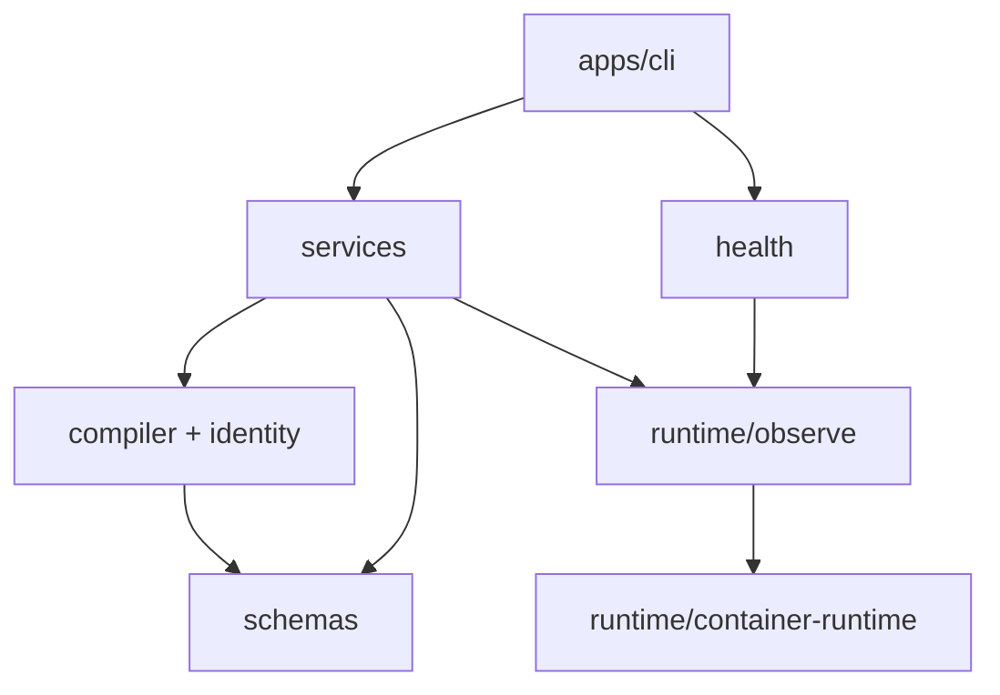
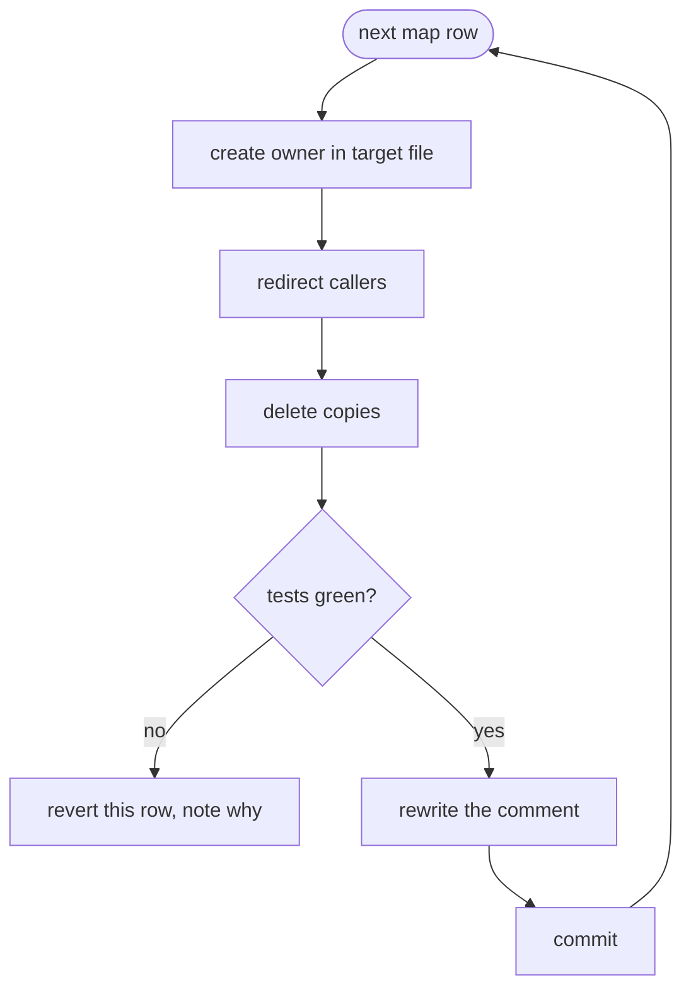

# S37: ownership — one fact, one reader

# 1 · Requirements

## Introduction

The seam review found the same behaviour implemented two to five times, and runtime
observation living in a use-case module. This sprint moves code so each fact has one owner,
deletes the copies, and rewrites the comment above each moved function so it states the
invariant and not the history. Behaviour is identical before and after: every test green at
both ends, and no diff in this sprint changes what a command prints.

## Glossary

- **owner**: the one function that reads a file or answers a runtime question. Everyone
  else calls it.
- **move**: a function changes file; its body does not change in the same commit.

## Mental Model & Invariants

- The layers in `docs/steering/structure.md`: `apps/cli` → `services`, `health` →
  `compiler`, `traits`, `schemas`; only `runtime` spawns.
- A fact has one reader. The ownership map below is the list; a row with two entries in
  the "today" column ends with one.
- A moved function's comment is one to three lines: what it returns, the invariant it
  holds, and a pointer to `docs/history/` if the history matters.

## Decisions & Corrections (log)

- 2026-09-05 — comment hygiene rides with the moves rather than as its own sprint: the
  moment a function is touched is when its comment is re-read.

## Configuration

One loader. `APPBAY_HOME` resolution lives in core with the CLI's saved-path rule as a
parameter; `cli/index.ts` stops writing `process.env.APPBAY_HOME`.

## Requirements

### Requirement 1: the runtime adapter owns observation
1.1 `composePs`, `parseComposePsJson`, `findCrashedServices`, `snapshotContainers`,
    `findContainerByLabel`, `tryExec` SHALL live in `runtime/`; the three `tryExec` copies
    and the second compose-ps parser (`cli/commands/ps.ts`) SHALL be deleted.
1.2 THE six hand parsers of `ps --format {{.Names}}` SHALL call one adapter function.
1.3 THE three hand-written podman branches (`checks.ts:531-541`, `:660`,
    `init-system.ts:276`) SHALL be `RuntimeProfile` fields.

### Requirement 2: one loader per file
2.1 `etc/system.yaml` SHALL be read only through `schemas/instance.ts`; the regex readers in
    `init.ts:750`, `instance-vars.ts:50`, `system-config.ts:57` SHALL be deleted or call it.
2.2 `.env` / `.env.local` SHALL be parsed only by `config-service.ts:parseEnvFile`.
2.3 `appbay.yaml` SHALL be parsed only through `AppbayYamlSchema`.

### Requirement 3: one home resolver
3.1 Core SHALL export one `resolveHome(opts)`; the four private copies SHALL be deleted;
    `cli/index.ts:78` SHALL not write env.

### Requirement 4: identity owns every generated name
4.1 `builds.ts:285`, `compile.ts:654`, the shepherd target prefix, `appbay_shared`,
    `appbay.server` SHALL come from `identity.ts`.

### Requirement 5: one doctor, one compile call
5.1 `setup.ts:showSetupStatus` SHALL call `runChecks`.
5.2 THE five `compile()` callers SHALL share one options builder.

### Requirement 6: comments
6.1 EVERY function moved SHALL carry a comment of at most three lines stating the
    invariant; the narrative moves to `docs/history/seam-review.md` if not already there.

### Non-Functional
- **NF 1** — each move is its own commit, behaviour-identical; `git log --follow` works.
- **NF 2** — tests green before and after every commit.

## Out of Scope
- Any behaviour change (S36 before, S38 after).
- The socket-based adapter (R7, human decision).

# 2 · Design

## End-to-End Walkthrough

The sprint walks the ownership map top to bottom. For each row: create the owner in its
target file if absent, redirect every caller, delete the copies, run the tests, commit.
Rows are ordered so a move never depends on a later one.

## Ownership map

| fact or behaviour | today | owner after |
|---|---|---|
| spawn the runtime binary | `containerExec`, 3× `tryExec`, 12 literal `docker` (S36 removes the literals) | `runtime/container-runtime.ts: exec()` |
| compose ps rows | `deploy-service.ts:100-190`, `cli/commands/ps.ts:51` | `runtime/observe.ts: composePs()` |
| crashed services, snapshots, converge diff | `deploy-service.ts:190-270` | `runtime/observe.ts` (`didConverge` takes two snapshots) |
| find container by label / by name | `deploy-service.ts:416`, `edge-identity-service.ts:139`, `setup.ts:303`, 6× `ps --format {{.Names}}` | `runtime/observe.ts: findContainer()` |
| `.State.Running` | 4 sites | `runtime/observe.ts: isRunning()` |
| network exists | 5 sites | `runtime/observe.ts: networkExists()` |
| runtime and compose version | `facts.ts:131`, `checks.ts:208,305,323,340`, `info.ts:49-50`, `init-system.ts:344` | `runtime/container-runtime.ts: versions()` |
| podman-vs-docker templates | `checks.ts:531-541,660`, `init-system.ts:276` | `RuntimeProfile` fields |
| `etc/system.yaml` | `instance.ts:225` + 3 regex readers | `schemas/instance.ts: loadInstanceConfig()` |
| `.env` parse | `config-service.ts:152`, `deploy-service.ts:771,902` | `config-service.ts: parseEnvFile()` |
| `appbay.yaml` parse | schema + 4 `as Record` sites | `schemas/appbay-yaml.ts: parseManifest()` |
| APPBAY_HOME | `cli/utils/appbay-home.ts:182` + 4 core copies | `runtime/home.ts: resolveHome({ savedPathRule })` |
| generated names | `identity.ts` + bypasses | `identity.ts` (adds `sharedNetworkName`, `serverContainerName`, `shepherdTarget`) |
| semver compare | `checks.ts:46`, `update.ts` | `cli/utils/semver.ts` |
| doctor | `health/checks.ts:1018`, `setup.ts:284` | `health/checks.ts` |
| compile options | 5 callers | `services/compile-options.ts: compileOptionsFor(home)` |

## Architecture Overview

## Workflow

## Key Algorithms
None new; every function moves with its body.

## Sequence Diagrams
Unchanged from S36; only file locations change.

## Testing Strategy
- The existing suite at both ends of every commit.
- A new arch test: `packages/core/src/__tests__/arch.test.ts` greps for a second parser
  of each owned file and for `spawnSync(` outside `runtime/`; fails on any hit.
- Test command: `pnpm turbo test`.

## Correctness Properties
### Property 1: behaviour-identical
- **Statement**: for any command, its output before and after the sprint is byte-identical
  on the scratch-home journey.
- **Validates**: NF 1

## Edge Cases
- `cli/index.ts:78` env publication: removing it exposes any core path that still resolves
  home privately; the arch test greps for `APPBAY_HOME` outside `runtime/home.ts`.

## Decisions
### Decision: comment hygiene rides with moves
**Context:** 348 narrative blocks. **Options:** a separate sweep; rewrite as each function
moves. **Decision:** with moves. **Rationale:** a comment is re-read when its function is
touched; a separate sweep re-reads everything twice.

# 3 · Tasks

## Status marks
<!-- [ ] pending | [x] done | [!] BLOCKED: reason | [-] DROPPED: <reason> | [>] → <spec_id> -->

## Tasks

- [ ] 1. Foundation
  - [x] 1.1 arch test written — allowlists name today's violators exactly, so it is green now and turns red the moment a list is wrong in either direction; `runtime/observe.ts` is created by the first move (2.2) rather than as an empty file
    - **Depends**: — · **Requirements**: 1.1 · **Pillar**: Legible, Verified
- [ ] 2. Moves, one commit each, in map order
  - [x] 2.1 `tryExec` → one in `runtime/container-runtime.ts`; `containerExec` already owns the runtime spawn · **Requirements**: 1.1
  - [x] 2.2 compose ps + parsers → `runtime/observe.ts: composePs()`; `cli/ps.ts` calls it with `all: false` (running only, as before); `formatPorts` moved with it · **Requirements**: 1.1
  - [x] 2.3 crash/snapshot/converge → `observe.ts`; comments cut to the invariant · **Requirements**: 1.1
  - [x] 2.4 `isRunning`, `networkExists`, `runningContainerNames` in `observe.ts`; callers in checks, server, init, setup, stats, tunnel redirected; `findContainerByLabel` already owned the label lookup · **Requirements**: 1.2
  - [x] 2.5 `versions()` in the adapter; `versionPattern`, `composeBundled`, `systemdUnit`, `serviceAccountEnv`, `serviceAccountGrant`, `rhel` are profile fields; init-system, checks, facts, info branch on data, not on the binary name · **Requirements**: 1.3
  - [x] 2.6 `loadInstanceConfig` (absent ≠ unreadable); the seven `?? ""` callers and the three regex readers are gone; doctor's store-binding check says unknown on an unreadable config · **Requirements**: 2.1
  - [x] 2.7 `.env` parse is `parseEnvFile` only (the two deploy copies went with S36's `resolveDeployEnv`); the installer's `vars` read and the traefik fragment merge go through zod; the two round-trip editors are exempt with the reason in the arch test · **Requirements**: 2.2, 2.3
  - [x] 2.8 `runtime/home.ts` owns the four tiers; the CLI, the runtime cache and the three secret providers call it; `cli/index.ts` no longer writes `APPBAY_HOME` into its own environment · **Requirements**: 3.1
  - [x] 2.9 `SHARED_NETWORK`, `SERVER_CONTAINER`, `shepherdTarget` live in identity; the build evictor and the ollama probe find containers by label instead of rebuilding names; the arch rules apply to code, not comments · **Requirements**: 4.1
  - [x] 2.10 `compileInstall(home, {apps, projectVars})` replaces the six identical compile blocks; one `compareSemver`; setup's network row is doctor's `checkNetwork` (the rest of setup status is setup-specific and stays) · **Requirements**: 5.1, 5.2
- [ ] 3. Comments
  - [ ] 3.1 every moved function's comment ≤ 3 lines; count of marker blocks in moved files reported before/after · **Requirements**: 6.1
- [ ] 4. Verification
  - [ ] 4.1 scratch-home journey output diffed against the S36 close · **Properties**: 1
  - [ ] 4.2 arch test green · **Requirements**: 1.1, 2.x, 3.1

## Log

**2026-09-05** — drafted from the seam review and the review set of the same date.
