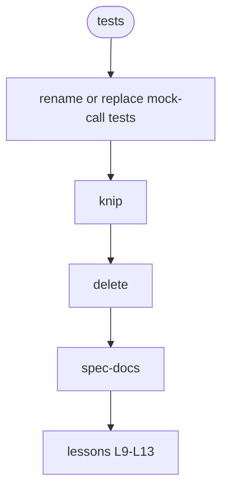

# S38: verification and docs — the repo is fit to study

# 1 · Requirements

## Introduction

After S36 fixed behaviour and S37 fixed ownership, this sprint makes the remaining noise
go away: tests that do not run what they name, dead code, docs that describe a layout that
no longer exists, and the lessons the rewrite has not yet received.

## Mental Model & Invariants

- A test's name is a claim about a behaviour; its body runs that behaviour or the name
  changes.
- `knip` reports zero unused exports.
- Every doc path and symbol resolves.
- stackbay's lessons file carries L9–L13 from `docs/history/seam-review.md`.

## Requirements

### Requirement 1: honest tests
1.1 THE four tests that assert only `toHaveBeenCalled*` SHALL run the boundary against a
    real filesystem or be renamed for what they test.
1.2 THE command actions for `doctor`, `status`, `ps`, `update`, `eject` SHALL each have one
    test that drives the action against a scratch home.

### Requirement 2: dead code
2.1 `knip` SHALL be installed and run in CI; everything it names on first run is deleted or
    justified in the sprint log.

### Requirement 3: docs
3.1 `/spec-docs` SHALL run over `README.md` and `docs/**`; stale paths and symbols fixed.
3.2 `docs/guide/overlays.qmd` and `README.md` SHALL describe `when:` as the collection sprint
    implements it, once it has.

### Requirement 4: harvested
4.1 stackbay `docs/design/lessons-paid-for.md` SHALL gain L9–L13 as proposed in the seam
    review, each with the appbay-cli file and line it came from.

### Requirement 5: secrets never on argv (from the row-23 audit)
5.1 THE shepherd SHALL take any payload on stdin; no secret byte, seed, or bundle SHALL
    appear in the container binary's argv. A test pins it.
5.2 THE five injection modes SHALL be described in `docs/guide/` with the exposure each one
    accepts, so the manifest author's choice is informed.

### Non-Functional
- **NF 1** — a RHEL-family Docker bootstrap run (issue #8) is attempted; if no VM can be
  provisioned, the attempt and its wall are logged and the issue stays open.

## Out of Scope
- New behaviour.

# 2 · Design

## End-to-End Walkthrough
A reader opens `docs/README.md`, follows it to the guide for `up`, reads
`services/deploy-service.ts` and finds one implementation of each thing it does, with
comments that state invariants; opens its test and sees the behaviour run. The rewrite's
author opens L9–L13 and finds the file and line each lesson was paid for at.

## Architecture Overview
No structural change.

## Workflow

## Testing Strategy
- `pnpm turbo test` green; `knip` zero; `check:docs-cli` and `check-docs-manifests` green.

## Correctness Properties
### Property 1: no name without a run
- **Statement**: for any test whose name contains a verb of effect (writes, creates,
  deploys, runs, installs), its body invokes the code path that performs it.

# 3 · Tasks

- [ ] 1. Tests · 1.1 mock-call tests (R1.1) · 1.2 command action tests (R1.2)
- [ ] 2. Dead code · 2.1 `knip` in, first run resolved (R2.1)
- [ ] 3. Docs · 3.1 `/spec-docs` (R3.1) · 3.2 `when:` docs after the collection sprint (R3.2)
- [ ] 4. Harvest · 4.1 L9–L13 in stackbay (R4.1)
- [ ] 5. Bootstrap · 5.1 issue #8 attempt logged (NF 1)
- [ ] 6. Secrets · 6.1 shepherd payload on stdin, argv clean, test (R5.1) · 6.2 modes documented with exposure (R5.2)

## Log

**2026-09-05** — drafted.
