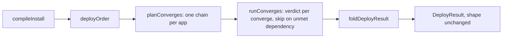
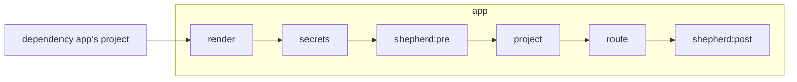
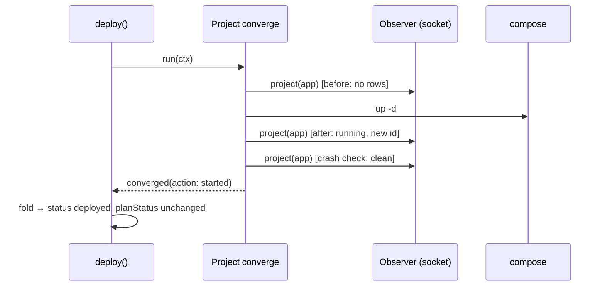

# S47: the deploy is a chain of converges, and the report is a fold over their verdicts

# 1 · Requirements

`deploy()` in `packages/core/src/services/deploy-service.ts` is an 870-line file whose loop
body walks each app through the same steps twice, once for a new or changed render and once
for an unchanged one, and keeps its counters live while it goes: fifteen increment sites,
fifteen `notReady.add` sites, and one decrement where the readiness wait takes back a
`deployed` it had already granted. Kun read it and named it the counter-example for the
review-ready pillar. This sprint restates it as the desired-state model the rest of the repo
already speaks: compile declares, the runtime is observed, each unit of an app's deploy
converges or reports why not, and the report is derived from those verdicts at the end.

## Mental model

- An app's deploy is a **chain of converges**, in this order: the **render** (compose file,
  `.env`, auxiliary files under `APPBAY_HOME`), the **secrets** (every reference resolves,
  `.env.local` parses), the **pre-deploy shepherd** actions the traits emitted, the compose
  **project** (`up -d`, then observed: what changed, what died, and when something depends
  on it, when it is ready), the edge **route**, and the **post-deploy shepherd** actions.
- Every converge answers one of three ways: **converged**, **diverged** with the reason, or
  **unobservable** with the runtime's reason. The third is the `Inspection` unknown lifted
  one level; it is never counted as success and never as failure.
- A converge whose dependency did not converge is **skipped**, with the dependency named.
  Across apps the dependency is the other app's project; within an app it is the previous
  link. This is the one rule that replaces `notReady`.
- Compose is the differ for containers. `up -d` runs on every deploy and the snapshot pair
  around it says what it did. Nothing in this sprint decides in advance that a project needs
  no converge.
- The **report** (`DeployResult`, unchanged in shape) is a fold over the verdicts, computed
  once. A counter is never incremented during execution.
- A trait's deploy-time part (the ingress trait's route, the secrets trait's materialise
  action) is built from what that trait emitted at compile time. Moving those constructors
  under the trait contract is a later sprint; this one leaves them reachable for it.

## Requirements

1.1 THE deploy SHALL have one code path from the render onward, for every plan status.
1.2 EVERY verdict about an app SHALL be derived after its converges ran, from their
    answers; no counter SHALL be written during execution.
1.3 THE project converge SHALL record what `up -d` did (`started`, `already-running`,
    `unknown`) on every path, not only for an unchanged render.
1.4 A converge whose dependency is not `converged` SHALL be skipped with the dependency
    named; an unobservable dependency SHALL block its dependents the same way.
1.5 THE `DeployResult` shape and every existing consumer (`up`, `apply`, `edge`, the deploy
    report) SHALL be unchanged except where 1.3 makes a report phrase false.
1.6 THE render converge SHALL make `var/lib/renders/<app>/` match the compile output on
    every deploy: compose file, `.env` copied from `etc/apps/<app>/.env`, and non-edge
    auxiliary files. The unchanged path's partial rewrite goes.
1.7 THE explicit wrapper-file materialisation on the new/changed path SHALL go; the
    pre-deploy action the secrets trait emits for the same references is the one writer.
1.8 THE deploy-service file SHALL be under 300 lines; the converge chain, the verdict
    fold and the edge route SHALL each live in a file a reviewer reads in one turn.
1.9 THE existing deploy tests (`deploy-converge`, `deploy-readiness`, `route-install`,
    `edge-target`, the arch rules) SHALL pass at every commit; new behaviour (1.3, 1.4, 1.6)
    SHALL carry a test that fails before it.

## Decisions & Corrections

**2026-09-06** — Kun: the file is bad enough to restructure before the human review reaches
it; the review track then reads the restructured file and its diff.

**2026-09-06** — Kun: the review track connects to the product through the pillars; a
pillar named review-ready is added to `docs/steering/pillars.md` and this sprint is the
first to claim it.

**2026-09-06** — A second agent proposed skipping `up -d` when a pure diff is empty,
compensating a failed route by stopping the container, reconciling independent apps in
parallel, and a Kubernetes runtime behind the same interface. Rejected, each for a reason
in the code: a pure container diff reimplements compose's config hashing and misses what
compose would have recreated; stopping a running app because the edge is down reverses the
decision recorded for appbay-cli#5 (report the partial state, the operator cleans up);
`installCaddyConfig` writes shared route files and reloads one process, so two concurrent
rollbacks clobber each other; the compose file is the desired-state format and a resource
interface does not change that.

**2026-09-06** — Kun: the architecture is trait-based, so the unit might be a trait handler.
Half right. The render and the project exist for an app with no traits, so they are not
trait handlers. The route and the shepherd actions are a trait's deploy-time half, and
today that half is hardcoded in the deploy or smuggled through `ShepherdAction`. This
sprint builds those two converges from the trait's compile output so a later sprint can move
their constructors under `TraitDefinition` beside `transform()`. The unit is named
**converge**, the verb `product.md` already uses for the deploy.

## Out of Scope

- A `converge()` on `TraitDefinition`. Issue #12 carries it, with the shepherd marker and the config-hash drift check below.
- A marker in `var/lib/state/` that makes a one-shot shepherd action observable. Until it
  exists the shepherd converges report converged when the actions ran clean, every run.
- Drift detection from `com.docker.compose.config-hash`. Verified present on Docker; not
  wired.
- The backup warning. It stays in `deploy()` until Kun's D3 decides what the trait means on
  a CLI-only install.
- `restart.ts`'s own `writeRenderedOutput` (ledger row 40). Noted, not touched.

# 2 · Design

## Walkthrough

`appbay up` calls `deploy()`. Setup is unchanged: collection filter, `.env` touch, compile,
the backup warning, `projects.yaml`, `deployOrder`. Then, per app in that order, the planner
builds the chain of converges with its dependencies; the executor walks the list in order,
asking each converge for its verdict or skipping it when a dependency did not converge; the
fold turns each app's verdicts into the `AppDeployResult` the CLI already prints.



One app's chain, and the two edges that leave it:



## Files

```
packages/core/src/services/
  deploy-service.ts        deploy(): setup, plan, run, fold; DeployOptions; re-exports of the public names
  deploy/converge.ts       Verdict, Converge, DeployContext, runConverges (the skip rule)
  deploy/converges.ts      the six links; writeRenderedOutput, resolveDeployEnv, runShepherdActions (moved)
  deploy/report.ts         foldDeployResult: verdicts → AppDeployResult and the counts
  deploy/route.ts          runCaddyCommand, installCaddyConfig, installRoute, describeRouteFailure (moved)
```

## Contract

```ts
type Verdict =
  | { kind: "converged"; action?: "started" | "already-running" | "unknown"; unknownReason?: string }
  | { kind: "diverged"; detail: string; reason?: "rejected" | "unavailable" | "skipped" }
  | { kind: "unobservable"; reason: string };

interface Converge {
  readonly id: string;        // "<app>/<kind>"
  readonly app: string;
  readonly kind: "compile" | "render" | "secrets" | "shepherd:pre" | "project" | "route" | "shepherd:post";
  readonly dependsOn: string[];
  run(ctx: DeployContext): Promise<Verdict>;
}
```

`action` is set by the project converge only and reuses the `convergeAction` vocabulary the
report already prints.

## Executor

```
ALGORITHM runConverges
  input:  converges in execution order (the planner emits them so), ctx
  output: Map<id, Verdict>
  for each c:
    unmet = c.dependsOn where verdicts[d]?.kind != "converged"
    if unmet not empty:
      apps = distinct app names of unmet ids that are not c.app
      detail = apps non-empty
        ? "skipped: depends on <apps>, which did not become ready"
        : "skipped: <unmet[0]> did not converge"
      verdicts[c.id] = diverged(detail, "skipped")
    else:
      verdicts[c.id] = await c.run(ctx)
  return verdicts
```

A dependency absent from the map (the app had a compile error and emitted no project) is
unmet. An unobservable project is unmet: its dependents do not start over a dependency
nobody saw ready (1.4). Today they do, because the unknown branch `continue`s past
`notReady.add`.

## Project converge

```
ALGORITHM Project.run
  before  = snapshotContainers(observer, app)
  dc      = dockerCompose(["up","-d"], composePath, env)
  if dc.exitCode != 0: return diverged(dc.output)
  after   = snapshotContainers(observer, app)
  crashed = first read; if clean and grace > 0: sleep(grace), read again
  if crashed unknown:            return unobservable(crashed.reason)
  if crashed non-empty:          return diverged("container(s) exited immediately after start: …")
  moved   = didConverge(before, after)
  action  = moved unknown ? "unknown" : moved.value ? "started" : "already-running"
  if waitReady:
    poll isReady every 2 s until deadline; unknown breaks with its reason
    if not ready: return diverged("not ready within <s>s: <last>")
  return converged(action, unknownReason)
```

`waitReady` is set by the planner when `dependentsOf(app)` is non-empty, as today. The
readiness wait moves before the route install: an app that never became ready is not routed.

## Fold

Per app, verdicts in chain order; the first that is not `converged` decides:

| first non-converged | status | fields |
|---|---|---|
| none | `deployed` if plan is new/changed, or plan unchanged and action `started`; else `unchanged` | `convergeAction`, `unknownReason` from the project |
| `compile`, `render`, `secrets`, `shepherd:pre`, `project` diverged | `failed` | `error` = detail |
| `project` unobservable | `unchanged` | `convergeAction: "unknown"`, `unknownReason` |
| `route` diverged | `failed` | `error` = detail, `containerStartedWithoutRoutes`, counts in `startedButUnrouted` |
| `shepherd:post` diverged | as "none" | `shepherdErrors` = the action errors |

Counts are the tally of statuses. The decrement at today's line 858 has no equivalent.

## Sequence, one unchanged app whose container was killed



## Testing

- Existing: `deploy-converge.test.ts`, `deploy-readiness.test.ts`, `route-install.test.ts`,
  `edge-target.test.ts`, `arch.test.ts`; green at every commit.
- New, in `deploy/__tests__/`: the fold table above as a pure test over hand-built verdict
  maps; the skip rule including an unobservable dependency; the render converge copying
  `.env` on an unchanged plan; `convergeAction` recorded on a new plan.
- Runtime: the Docker journey on this Mac; the Podman journey on the Lima guest if the shim
  from S45 still runs. The result goes in the log with the command.

## Correctness properties

1. For any app, the number of `AppDeployResult` rows equals the number of apps compiled, and
   `deployed + unchanged + failed` equals that number.
2. For any app whose project verdict is not `converged`, no app that depends on it has a
   project verdict at all other than `skipped`.
3. For any plan status, a `deployed` app has a project verdict of `converged`.

# 3 · Tasks

- [x] 1.1 `deploy/converge.ts`: the contract and `runConverges` (1.4)
- [x] 1.2 `deploy/report.ts`: `foldDeployResult` and its table test (1.2)
- [x] 1.3 `deploy/converges.ts`: the six converges; `deploy()` becomes setup, plan, run,
      fold; both branches, `notReady`, the dead `existsSync` guard, `stateDir` and the
      explicit wrapper call go (1.1, 1.3, 1.6, 1.7)
- [x] 1.4 `apps/cli/src/utils/deploy-report.ts`: the "plan was unchanged" phrase only when
      it was (1.5)
- [x] 1.5 `deploy/route.ts`: the Caddy and route functions move; `arch.test.ts` and
      `edge-target.test.ts` follow them; the file header stops naming a tRPC caller (1.8,
      ledger row 12)
- [x] 1.6 New tests: skip rule with an unobservable dependency, `.env` copied on an
      unchanged plan, `convergeAction` on a new plan (1.9)
- [x] 1.7 Journey on Docker (Rocky 9 guest) and on rootful Podman (Fedora guest); log below
- [x] 1.8 `docs/steering/structure.md` names `services/deploy/`; ledger rows updated; the
      trait-owned-converge issue opened; close

## Log

**2026-09-06** — created from the review conversation over `deploy-service.ts`; baseline
core 1111 passed, CLI 385 passed, `tsc --noEmit` clean.

**2026-09-06** — shipped in four commits: ed23b7c (contract, executor, fold, their table test),
e47cf9a (the cutover: one chain per app, `deploy-service.ts` 869 → 161 lines, route functions
to `deploy/route.ts`), 0211a1c (the three tests for the new behaviour, `structure.md`), and
the close. core 1126 passed (1111 before), CLI 385, `tsc --noEmit` clean in both packages.

Behaviour that changed, each with its test or journey: `convergeAction` is recorded on a new
plan; an unobservable dependency blocks its dependents; the render's `.env` is copied on an
unchanged plan; post-deploy shepherd actions run on an unchanged plan too (the old unchanged
branch never ran them; no trait emits one today, so no test); the readiness wait runs before
the route install; wrapper-file secrets are materialised once, by the trait's action.

Runtime evidence, the new Linux arm64 binary (md5 `19cab435a34c5642f11e19eda276ac62`)
installed in both Lima guests and `s29-journey-deploy-reporting.sh` run through the
multipass shim:

```
PATH=/tmp/mp:$PATH VM=podman PRIV=sudo CBIN=podman HOME_DIR=/root/.appbay \
  ./scripts/journeys/s29-journey-deploy-reporting.sh            → 10 passed, 0 failed
PATH=/tmp/mp2:$PATH VM=rocky PRIV="sudo env PATH=/usr/local/bin:/usr/sbin:/usr/bin:/sbin:/bin" \
  CBIN=docker HOME_DIR=/var/lib/appbay ./scripts/journeys/s29-journey-deploy-reporting.sh
                                                                → 10 passed, 0 failed
```

R1–R5 are appbay-cli#4 (the deployment is counted, the idempotent control still says 0, the
recreated container is a deployment while the plan stays UNCHANGED); R7–R10 are appbay-cli#5
(a stopped edge is "not running", not "rejected", and the partial converge is reported as
partial). On Rocky, `sudo` drops `/usr/local/bin` from PATH, so the first run failed at
`appbay init` inside the payload; `PRIV` carries the PATH. `s26-journey-apply-success.sh` does
not run on either guest: it and fifteen other journeys `cd /home/ubuntu`, the multipass user's
home (ledger row 42).
